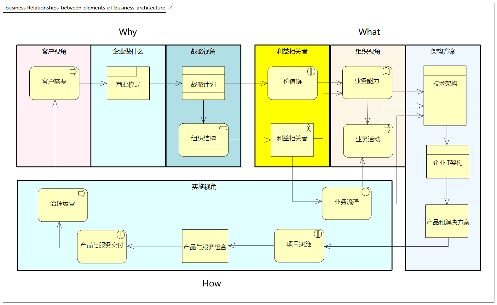

# 业务架构的内容框架

不同的企业或理论对企业架构具体涉及的内容的设计或描述有所不同。但在企业架构的组成要素中，其中有几个非常高频，这里我们从整体企业架构的角度，聚焦较重要的几个组成部分展开分析。

> 图例：业务架构内容框架

业务架构承接战略计划，并为企业IT架构与项目运营提供指导，是企业战略计划转化为实际项目及日常运营的渠道，业务架构包括以下核心要素。

- **商业模式**：本质上是企业战略计划中对企业业务的商业模式的描述，回答企业用什么方式盈利，如何盈利，开展什么业务等。
- **价值链**：描述企业的业务价值链条，本质上是业务流程的顶层能力和流程的体现。
- **业务能力**：执行产生价值结果的活动的能力体现，过程中可能包括组件化的分析，对企业的业务进行全面、直观的反映。
- **业务流程**：由一系列业务活动经过一定的逻辑方式组合起来，以实现某种业务目标的过程。
- **组织架构**：与业务架构密切相关，包括业务划分、相关的职责和权利，也涉及绩效考核。

我们再通过"业务架构各个元素之间的关系图"看看这些概念之间的关系。

- **从战略角度主要回答Why**，客户需要什么，企业通过商业模式回答要做什么，战略计划是什么，并伴随着组织结构的设定。
- **业务架构主要回答What的问题**，通过对战略计划的分解，产生价值链，并进而分析出业务能力及业务流程，业务能力关注结果，业务流程关注过程，再结合核心的业务活动，进而产出业务架构。从架构视角来看，业务架构是企业IT架构的输入，领域服务、领域模型、数据模型等都是企业IT架构的范畴，进而从方案视角设定企业产品和解决方案。
- **通过实施视角回答How的问题**，也就是通过项目落地实施，产出产品与服务的具体组合，进而交付给客户，同时经过治理运营进行持续的迭代优化。

> 图例：业务架构各元素之间的关系