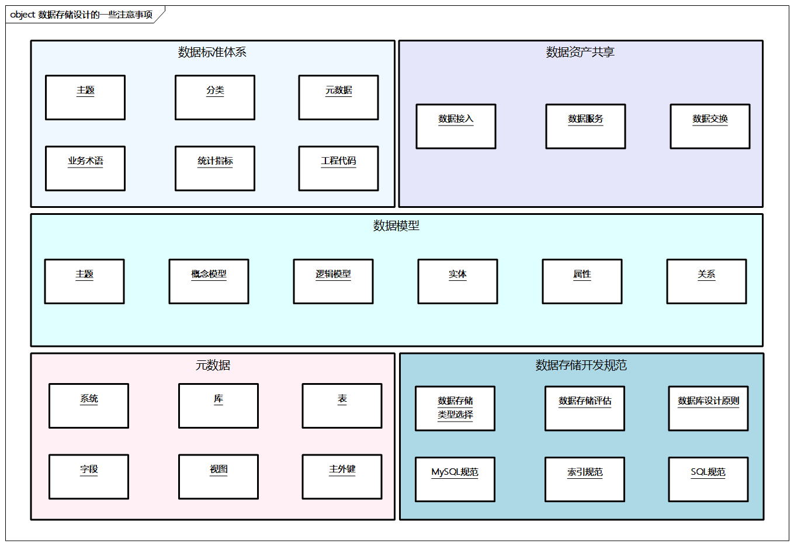

# 数据架构原则和规范

数据架构中需要制定相应的原则和规范，指导数据架构的规划和设计。这里就与数据架构相关的数据架构总体原则、数据治理规范、数据存储开发规范进行介绍，这些原则和规范是笔者根据自身经验总结出来的，大家可以作为参考，但不能生搬硬套，在实践中需要灵活应用。

## 数据架构总体原则

- **整体性原则**：数据架构必须根据总体方案统一规划，进而多级实施。
- **基于业务原则**：数据是为业务服务的，承载着相应的业务能力和应用功能，与领域模型相对应。
- **标准化原则**：统一规划数据服务标准、数据交换标准，以及提供数据读写访问功能、基本数据处理逻辑。
- **隔离原则**：数据与应用分离原则、数据异构原则、数据读写分离原则。
- **数据一致性原则**：数据必须一致，每个数据系统内限制获取次数，各部门需要遵循整个公司的数据定义，并尽量共享已有数据。
- **数据安全原则**：保证业务和应用的信息安全和运行安全，同时关注数据质量，确保数据的可用性、准确性及完整性。

## 数据治理规范

- 数据按对象进行管理，明确数据对应的组织（Owner），**每个数据都只能有唯一的Owner**。
- 从企业架构层面、业务和应用**全局视角来定义数据治理相关规范**，并紧密结合其他企业架构。
- 数据治理**各项标准需要长期迭代**，并在企业层面制定相应的**奖惩措施**。
- 为了**降低数据之间的耦合度**，可以通过设置主副数据的方式进行数据解耦。
- 当业务数据量过大时，**单一数据响应吃力，可以考虑分库分表、多级数据缓存等方式**。
- **数据治理的目的是数据共享**，通过数据的优化治理，实现数据准确、完整、一致、可靠。

## 数据存储开发规范

下图为数据存储设计的一些注意事项，包括数据标准体系、数据资产共享、数据模型和元数据的关键信息，同时包括数据存储开发规范，这里就以下几个方面进行展开。


>图例：数据存储设计的一些注意事项

### 数据存储类型选择

我们在选择数据库时，需要以需求为导向，权衡多种因素，如数据量、并发量、实时性、一致性、读写分布、安全性及运维成本等。具体地，我们可以参考以下原则。

- **根据不同存储需求进行选择**：企业架构数据类型多样，单一的数据存储很可能满足不了所有需求，我们可以采用针对不同存储需求组合数据库的方式。
  - 将业务交易数据存储在关系型数据库中
  - 将JSON文件存储在MongoDB中
  - 将应用程序日志存储在Elasticsearch中
  - 将Blob对象存储在对象存储空间中
- **根据应用场景进行选择**：不同类型的应用系统可使用不同类型的数据库。
  - 比如内部的管理型系统，数据量和并发量都不大，可选择关系型数据库；
  - 大流量的电商系统或者活动促销型系统可选择NoSQL数据库；
  - 日志或者搜索类应用选择日志搜索型数据库；
  - 实时交易事务型应用（如OMS）可采取关系型、NoSQL和一致性事务组合方式；
  - 离线分析报表系统可选择列式或分析型数据库。
- **优先考虑可用性**：根据CAP原则，我们需要根据业务需求进行权衡，选择合适的数据库。
  - 使用分布式系统时，需要在可用性和一致性间进行权衡
  - 在面向互联网应用中，建议优先考虑可用性，通过最终一致性来实现更高的可用性
- **考虑团队能力**：在选择数据库时，我们需要考虑开发队伍的技术能力。新的技术可能需要开发人员了解新的使用模式、查询优化、性能调整等。
- **考虑事务处理能力**：在选择数据库时还需要考虑事务处理能力，特别是在多种数据库场景下，**单个事务可能将数据写入多个数据存储中，需要设计补偿事务来撤销已完成的数据处理操作**。

### 数据存储评估

虽然我们确定了数据库类型，但各种类型的数据库还有很多开源或商业化的技术产品，我们可以从以下几个维度来考虑。

- **功能点**：比如数据格式、数据大小、规模和结构、数据关系、一致性、`Schema`灵活性、数据迁移能力、数据生命周期。
- **性能效率**：服务连接数、响应时间、吞吐量、可扩展性、实时性。
- **可维护性**：监控报警、日志查询、协议许可、售后服务、`DevOps`适配性。
- **可靠性**：`SLA`、复制或备份、容灾能力等。
- **可移植性**：托管服务、地域可用性、数据本地/外部/云上迁移能力等。
- **安全性**：加密和验证、审计、网络安全等保合规、数据脱敏、防泄漏、全链路的数据校验。
- **成本**：总成本、`ROI`等。

### 数据库设计原则

针对数据库本身的设计，有以下通用的设计原则。

- 原始单据与实体之间的关系一般是一对一关系，也可以是一对多或者多对多关系。一般而言，一个实体不能既无主键又无外键。
- 表及字段之间的关系，尽量符合第三范式。有时为了提高运行效率，可以降低范式标准，适当增加冗余。
- 尽量减少多对多的实体关系设计，可以增加第三个实体。
- `E-R`图尽量结构清晰，关联简洁，实体和属性分配合理，没有低级冗余。
- 尽量减少数据库中的表、组合主键、表中的字段，防止数据库频繁打补丁。
- 可以通过优化`SQL`、分批分表、增加缓冲区、适当增加冗余等方法提高数据库运行效率。
- 数据结构和存储方案建议经过评审并沉淀成文档，做好版本管理。

### MySQL规范

- 表的命名最好加上“业务名称_表的作用”，表名不使用复数名词。
- 表名、字段名应使用小写字母或数字，数字不要在开头。
- 表必备三字段：`id`、`gmt_create`、`gmt_modified`。
- 每张表必须设置一个主键ID，且这个主键ID使用自增主键。
- 主键索引名为`pk_`字段名；唯一索引名为`uk_`字段名；普通索引名为`idx_`字段名。
- 单表列数目必须小于30，若超过则应该考虑将表拆分；单表行数超过500万行或者单表容量超过2GB，才建议进行分库分表。
- 合适的字符存储长度，不但可以节约数据库表空间、节约索引存储，而且可以提升检索速度。
- 如果存储的字符串长度几乎相等，则使用Char定长字符串类型，减少空间碎片。
- 禁用保留字，如`DESC`、`Range`、`March`等，参考`MySQL`中的保留字。

### 索引规范

- 业务上具有唯一特性的字段，即使多个字段的组合，也应建成唯一索引。
- 超过三个表禁止`Join`。需要`Join`的字段，数据类型必须绝对一致；当多表关联查询时，保证被关联的字段有索引。
- 当建立联合索引时，必须将区分度更高的字段放在左边。
- 利用覆盖索引（只需要通过索引即可拿到所需数据）来进行查询操作，避免回表查询。
- 在较长`Varchar`字段，例如在`Varchar（100）`上建立索引时，应指定索引长度，没必要对全字段建立索引，根据实际文本区分度决定索引长度即可。
- 如果有`ORDER BY`的场景，则请注意利用索引的有序性。

### SQL规范

- 为了充分利用缓存，不允许使用自定义函数、存储函数、用户变量。
- 在查询中指定所需的列，而不是直接使用“`*`”返回所有的列。
- 禁止使用外键与级联，一切外键概念必须在应用层解决。
- 应尽量避免在`Where`子句中使用“`or`”作为连接条件。
- 不允许使用“`%`”开头的模糊查询。
- 如果有国际化需要，那么所有的字符存储与表示，均以`UTF-8`编码。
- 事务中需要锁多个行，要把最可能造成锁冲突、影响并发度的锁往后放。
- 减少死锁的主要方向，就是控制访问相同资源的并发事务量。
- 无`Where`条件下的性能排序：`count(字段)<count(主键ID)<count(1)≈count (*)`。
- 避免使用`Select *`，在查询中，不要使用“`*`”作为字段列表。
- 避免大字段存储传输，优化子查询，尽量避免在·以内。

### 分库分表原则

下面介绍一下分库分表。分库分表有以下几种形态。

1. **水平分库**：以字段为依据，将一个库中的数据拆分到多个库中。每个库的结构都一样；每个库的数据都不一样，没有交集；所有库的并集是全量数据。水平分库适用于总并发高且难以根据业务归属垂直分库的场景。
2. **水平分表**：以字段为依据，将一个表中的数据拆分到多个表中。每个表的结构都一样；每个表的数据都不一样，没有交集；所有表的并集是全量数据。水平分表适用于单表的数据量过高的场景。
3. **垂直分库**：以表为依据，将不同的表拆分到不同的库中。每个库的结构都不一样；每个库的数据都不一样，没有交集；所有库的并集是全量数据。垂直分库适用于总并发高，可以根据业务归属切分的场景。
4. **垂直分表**：以字段为依据，将表中字段拆分到不同的表中。每个表的结构和数据都不一样；所有表的并集是全量数据；一般来说，每个表的字段至少有一列交集，一般是主键，用于关联数据。垂直分表适用于单表的字段过多，并且热点数据和非热点数据在一起的场景。

#### 分库分表的步骤建议

分库分表有一些工具支持，比如阿里云的`DRDS`。不过，不管是使用工具还是自己实现，都需要遵循一些原则。

1. 评估当前数据库的瓶颈，确定是否一定要分库分表；
2. 如确定，则选择切分方式，分库还是分表、水平还是垂直；
3. 根据当前容量和增长量评估分库或分表个数；
4. 选`Partition Key`，注意要拆分均匀，同时考虑其他关键字段的查询；
5. 制定分表规则，如`Hash`或`Range`等；
6. 执行，比如采用双写的方式；
7. 考虑扩容问题，并尽量减少数据的移动。
