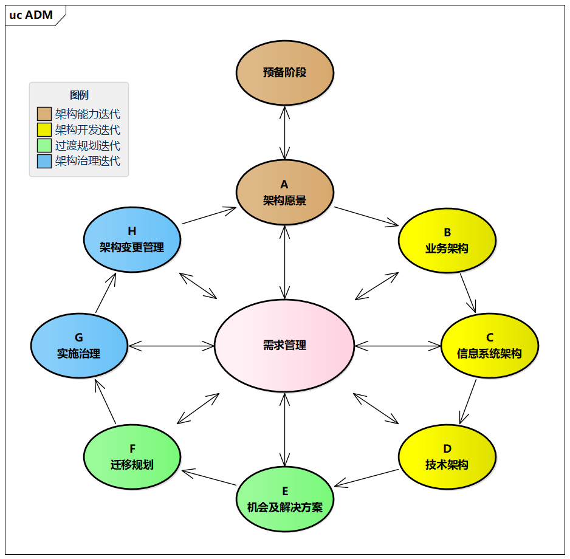
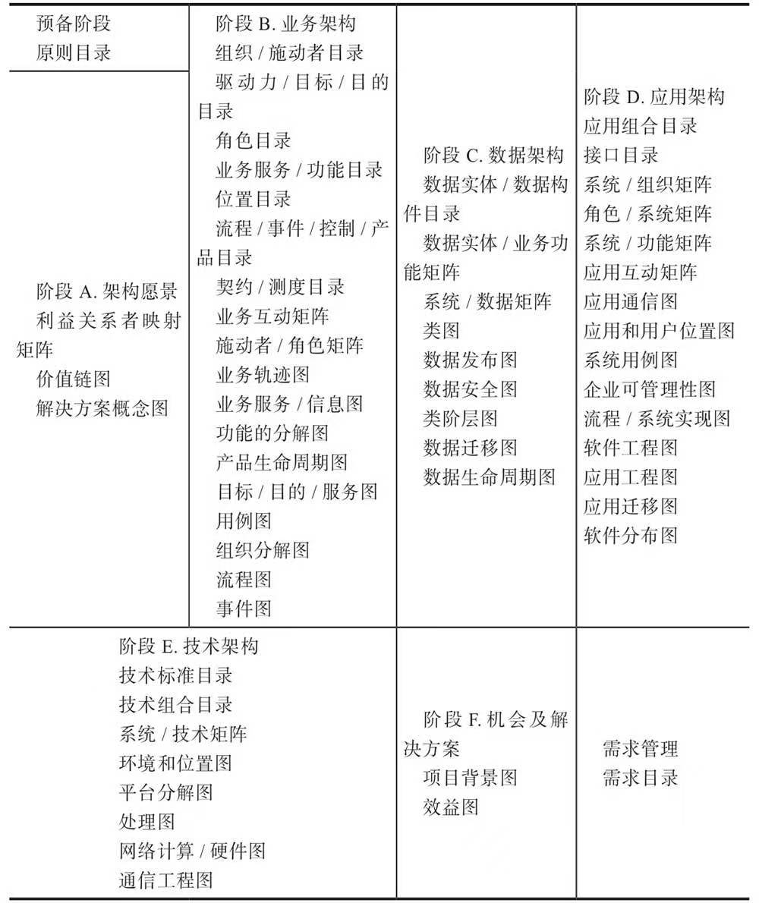

# TOGAF

一直以来，人们对架构理论的研究比较严谨，很注重用词。早期的架构理论，无论是Zachman还是TOGAF，都被称为“框架”​，而非“架构”​。

> Zachman框架为理解架构提供了一个很好的视角，但是没有给出具体的构建过程。在Zachman框架的启发下，TOGAF尝试去解决这个问题。

与以往的“单打独斗”不同，TOGAF发展成了一个横跨多个行业的论坛型组织，目前已拥有850多个成员机构，为TOGAF的通用性奠定了基础。

TOGAF的前身是美国国防部的“信息管理技术架构框架”​（`TechnicalArchitecture Framework of Information Management`，`TAFIM`）​。1993年，Open Group接受委托设计企业架构理论，期间还接受了美国国防部的指导，因此吸收了TAFIM的经验。经过Open Group近两年的努力，TOGAF 1.0于1995年诞生。由于当时正处于企业架构理论的兴盛期，TOGAF一直以每年一版的频率持续更新，到2002年更新到了8.0版，正式扩展为完整的企业架构，并且开始对外提供架构认证培训服务。之后，TOGAF的更新速度放慢，2009年发布了9.0版， 2012年发布了9.1版，而最新的9.2版到2018年才发布。TOGAF认证目前也是企业架构领域比较权威的认证。

## 1. TOGAF简介

与Zachman框架相比，TOGAF给出了对架构过程的完整指导。TOGAF构建过程包括八个阶段，依次为:

- **架构愿景**
- **业务架构**
- **信息系统架构**（应用架构和数据架构）​
- **技术架构**
- **机会及解决方案**
- **迁移规划**
- **实施治理**
- **架构变更管理**(涵盖了远景描绘、架构构建、架构实施、架构治理等方面)。

在俗称[“麦田怪圈”](https://baike.baidu.com/item/%E9%BA%A6%E7%94%B0%E6%80%AA%E5%9C%88/81806)的架构构建过程中，需求管理处于中心位置，说明架构构建各个阶段都是需求驱动的，也说明了需求的变化对构建过程有着深远的影响。

“麦田怪圈”只是TOGAF六大构件中的一个，此外还包括架构内容框架（详细的架构工作产品模型）​、参考模型、ADM指引与技术、企业连续统一体（类似具有演进特征的架构资产库）​、架构能力框架（运转企业架构必需的技术、组织、角色等，类似管理体系）​，可以说是应有尽有了。

​“麦田怪圈”如图所示。

### 1.1. TOGAF的构建过程

TOGAF整个架构构建过程围绕着“需求管理”可以分为四类迭代，分别是：

#### 1.1.1. 架构能力迭代：获得企业承诺

**预备阶段：** 虽然在主圈外，但仍需要重新回来评估EA（业务分析）团队和企业承诺情况。

**A.架构愿景：** 有一个利益相关者、复杂性、变化和目标的整体视图。这不是一次昨晚，架构愿景会慢慢浮现出来，持续演化和沟通是关键。

#### 1.1.2. 架构开发迭代：设计正确架构（as-is/to-be）

**B.业务架构：** 独立于技术而关注业务能力、流程和产品是非常重要的，这是业务相关的架构视角分析。

**C.信息系统架构：** 这是顺接业务转向IT的重要架构，一般又分为应用架构和数据架构。

**D.技术架构：** 关注基础设施（例如硬件和通讯）以及平台/中间件，是技术人员的视角，关注技术的可行性和可用性。

#### 1.1.3. 过渡规划迭代：投资架构路标

**E.机会及解决方案：** 从整体架构视角到如何为架构进行交付、投资和分配资源。这是一个重要的迭代，需要在架构愿景和业务架构之间找到平衡，以确保架构的可行性。

**F.迁移规划：** 项目管理者比架构师更多参与，确保详细规划与架构愿景保持一致。

#### 1.1.4. 架构治理迭代：正确架构实施

**G.实施治理：** 需监控每个项目和解决方案遵从与架构，在合规性上不能妥协，说明大家追求长期愿景。确保架构的实施和维护，这是一个持续的过程，需要不断调整和改进。

**H.架构变更管理：** 当项目和解决方案不能满足原有期望时，需回到其他阶段去解决。架构是一个动态的过程，需要不断调整和改进，这是一个持续的过程。

### 1.2. TOGAF交付物

TOGAF 9.0的交付物如表所示。

## 2. TOGAF具有适配性

**TOGAF的构建过程本身就是瀑布式的，因此与瀑布模型更加适配**。

在2002年之前，TOGAF更新比较频繁，大部分工程都是按照瀑布模式执行的，尤其是对于认可企业架构理念的大型企业而言，TOGAF理念很适合构建企业架构和指导企业工程，也正因如此，TOGAF声称自己曾占有企业架构领域半壁江山。咨询机构将TOGAF如此清晰的流程吸收，并将其转化为咨询产品进行输出。TOGAF清晰的体系也提高了过程的可控性和对交付物的管理能力，但由于其交付物比较多、体量庞大、不易维护，TOGAF后来也遭人诟病。

此外，即使到了9.2版本，TOGAF依然只是在探讨与SOA的结合，并没有考虑更新的架构风格和工程方法。

## 3. TOGAF对企业和业务架构的定义

TOGAF应该是第一个明确提出业务架构概念的架构框架。在TOGAF 9.2版中提到，业务架构定义了企业战略、治理、组织和关键业务流程。

为了理解TOGAF对业务架构的定义为何如此模糊，需要先理解它对企业和企业架构的定义。TOGAF将“企业”定义为“有一系列共同目标的组织集合体”​，也就是说，企业还可以是政府、团体和某组织中的部门等，相当宽泛。​“企业架构”的定义也类似，既可以是完整的企业架构，也可以是领域层面的架构，它强调的是多个系统或者功能之间的交叉。

TOGAF采用了模糊的定义方式，定义的边界并不清晰。对于Zachman提出的架构缺乏统一概念和认知的问题，TOGAF给出了一个“灵活”的答案。

除了业务架构外，TOGAF还重点提出了另外三个架构：应用架构、信息（数据）架构、技术架构。这三个架构一般合称“IT架构”​，其中应用架构与信息架构又合称为“信息系统架构”​。业务架构与应用架构、信息架构、技术架构共同组成了人们常说的“4A架构”​。

## 4. TOGAF的重要意义

**企业架构是需要业务人员和技术人员共同建设的**。无论是在TOGAF诞生的年代还是在今天，传统企业中的技术人员都不是很多。如果没有一个清晰的流程指导企业开展企业架构建设，那么业务人员是很难融入架构开发过程中的。所以，流程对业务人员和技术人员而言都是很重要的。与此同时，正是由于TOGAF在流程方面的特点，要看一个企业是否采用了TOGAF理论指导企业架构开发，不是看最终的交付物，而是看过程。

> 传统企业在比较不同的企业架构理论时，不能只看一些对新锐工程方法的表面宣传，而是必须深入理解工程和架构的基本原理，这样才能找到最合适的工程逻辑。

不得不说，TOGAF是一个让人“爱恨交加”的框架，它的诞生使大家更加意识到，企业架构注定是一项庞大的工程，无论是架构开发还是架构维护，都很有挑战性。 **Zachman在论文中强调过架构工具的重要性，没有工具支持，繁重的架构管理工作会成为企业采用架构框架的“绊脚石”​。** 然而，与TOGAF配套的工具似乎不太容易被业务人员接受，只能让技术人员尝试。但是，这些缺陷并不会影响人们对TOGAF的评价，它依旧是企业架构成为可设计架构的关键性理论。

对企业架构的需求一直是真实存在的，架构管理能力优秀的企业无论其采取的是何种方法，都是企业架构价值的证明。

企业架构的价值并不依赖于特定的方法论而存在，这也要求我们在实践的基础上不断吸收各类方法论的合理之处，持续加强对方法论的研究，以便让企业架构更好地指导我们的工程实践。
