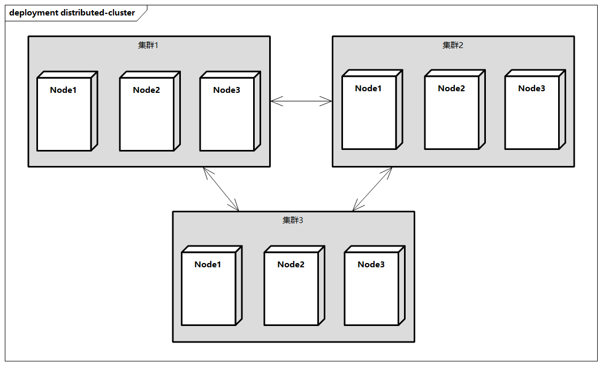
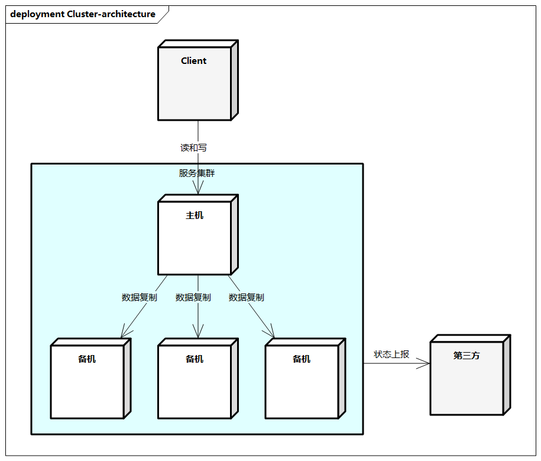

# 技术架构最佳实践

下面从最佳实践角度，介绍技术架构中一般需要考虑的设计点。

## 一致性理论

一致性在分布式架构，特别在微服务架构中特别重要。我们先来看看一致性的通用理论，再看看一些常见的一致性方案。

### 强一致性：ACID

强一致性的保障，比如传统单机数据库内的事务一致性，强一致性的模型有Paxos、Raft、Zab等。强一致性主要由四部分特性组成。

- **Atomicity**：**原子性**，一个事务中的所有操作，要么全部完成，要么全部不完成，不会结束在中间某个环节。
- **Consistency**：**一致性**，在事务开始之前和事务结束以后，数据库的完整性没有被破坏。
- **Isolation**：**隔离性**，数据库允许多个并发事务同时对其数据进行读写和修改，隔离性可以防止多个事务并发执行时由于交叉执行而导致数据不一致。
- **Durability**：**持久性**，在事务处理结束后，对数据的修改就是持久的，即便系统故障不会消失。

### CAP

CAP指的是在一个分布式系统下，包含三个要素。

- **C**：**一致性（Consistency）**，在分布式系统中的所有数据备份，在同一时刻一致（等同于所有节点访问同一份最新的数据副本）。
- **A**：**可用性（Availability）**，在集群中一部分节点出现故障后，集群整体还能响应客户端的读写请求（对数据更新具备高可用性）。
- **P**：**分区容错性（Partition Tolerance）**，对实际效果而言，分区相当于对通信的时限要求。系统如果不能在时限内达成数据一致性，就意味着发生了分区的情况，必须就当前操作在C和A之间做出选择。

**在分布式系统中，CAP不能完全兼容，P一般是客观存在的（如果没有分区，也就不是分布式系统），因此需要在AP和CP中进行取舍**。

- 若选择AP，继续让系统正常运行，提供服务，但不能确保整个系统所有节点的数据都是最新的，故舍弃了C
- 若选择CP，系统暂停服务，等待通信恢复并同步数据，暂停服务期间系统不可用，故舍弃了A

### 弱一致性：BASE

BASE理论主要是解决CAP理论中分布式系统的可用性和一致性不可兼得的问题。BASE理论包含以下三个要素。

- **基本可用（Basically Available）**：基本可用指的是分布式系统在出现故障的时候，允许损失部分可用性，即保证核心可用。
- **软状态（Soft State）**：软状态指的是允许系统存在中间状态，而该中间状态不会影响系统的整体可用性。分布式存储中一般一份数据至少会有三个副本，允许不同节点间副本同步的延时就是软状态的体现。
- **最终一致性（Eventual Consistency）**：最终一致性指的是系统中的所有数据副本在经过一定时间后，最终能够达到一致的状态。弱一致性和强一致性相反，最终一致性是弱一致性的一种特殊情况。

BASE理论与ACID不同，**满足CAP理论，通过牺牲强一致性来保证系统的可用性**。由于牺牲了强一致性，系统在处理请求的过程中，**数据可以存在短时的不一致**。系统在处理业务时，记录每一步的临时状态。当出现异常时，根据状态判断是否继续处理请求或者退回原始状态，从而达到数据的最终一致。

> 弱一致性的模型有DNS和Gossip协议。

### 提高一致性的方法

在分析了通用的一致性理论后，这里介绍几种提高一致性的方法。

1. **尽量避免数据一致性问题**。在设计上做将需要同时成功的数据放到一个服务中心内，同一个操作人的数据分布在同一个物理分片上，通过单机事务来保证，避免分布式事务。
2. **二阶段提交协议X/Open DTP**。X/Open DTP（Distributed Transaction Process）是一个分布式事务模型，此模型主要使用二阶段提交（Two-Phase-Commit，2PC）来保证分布式事务的完整性。在**这个模型中，有三个角色，即AP（应用程序协议）、RM（资源管理器）及TM（事务管理器，负责各个RM的提交和回滚）**。**二阶段提交的优点是提供了一套完整的分布式事务解决方案**，遵循事务严格的ACID特性**。二阶段提交的**缺点是TM通过XA接口与各个RM进行数据交互，从第一阶段的准备阶段，业务所涉及的数据就被锁定，并且锁定跨越整个提交流程。在高并发和涉及业务模块较多的情况下，对数据库的性能影响较大**，同时不支持特大型的系统规模，同时**存储组件有很多不支持XA协议**。
3. **TCC（Try-Confirm-Cancel）**。TCC方案是**二阶段提交的另一种实现方式**，它涉及三个模块，即**主业务、从业务和活动管理器**。第一阶段**主业务服务分别调用所有从业务服务的Try操作，并在活动管理器中记录所有从业务服务**。当所有从业务服务Try成功或者某个从业务服务Try失败时，进入第二阶段。在第二阶段中，**活动管理器根据第一阶段从业务服务的Try结果来执行Confirm或Cancel操作**。如果第一阶段所有从业务服务都Try成功，则协作者调用所有从业务服务的Confirm操作，否则调用所有从业务服务的Cancel操作。在第二阶段中，Confirm和Cancel同样存在失败的情况，所以需要对这两种情况做异常处理，以保证数据的一致性。
4. **基于消息的最终一致性**。使用半消息技术，**保证只要一个事件发生后，关联的结果事件一定会发生**。半消息技术解决了如下问题：事件发生后，消息发送却失败；消息发送成功后，消息代理推送给消费方却失败；消费方重复消费此消息。使用半消息技术，在事件发生前，先发送一个半消息，这样可以保证事件发生的消息一定能够发送成功。消息代理增加了事件结果查询功能，保证在事件触发成功后一定将消息推送给消费方。**消息代理保证消息至少推送一次，但要求消费方自己实现幂等性，避免出现异常**。


> 图例：基于消息的最终一致性

这里解释一下幂等（Idempotence），幂等是一个数学与计算机学概念，常出现于抽象代数中，公式为`f(x)=f(f(x))`。

一个幂等方法指的是在其入参相同时执行1次与执行N次的影响相同，返回结果相同，也就是说重复执行该方法不会影响系统状态，也不用担心重复执行会对系统造成改变。

幂等的方案可以通过发送方创建唯一ID，或者放入业务ID来实现；消费方增加一个过滤服务，每处理一个事件都会通过存储这个事件ID来实现，看是否已经消费过。

## 分布式集群

**分布式系统指的是多个机器之间通过网络进行交互，实现一个共同目标**。

分布式集群指的是一个特定领域的软件部署在多台服务器上，并作为一个整体提供一类服务，这里简称集群。

> 图例：分布式集群

### 关注点

在分布式系统中，需要我们关注以下几个方面的内容。

1. **高性能**：衡量**性能的重要质量属性**，如RT、QPS、资源利用率。**提高性能可以从单机和集群两个角度考虑**。
   - 单机需要考虑进程和线程，或者硬件指标（比如SSD提升I/O访问速度、提高处理器核数）
   - 集群需要考虑任务分配（如CDN、F5、LVS、Nginx）、任务调度、功能分解、多实例副本、数据分割等
2. **稳定性**：衡量系统在**故障发生时仍稳定可用的程度**。硬件可能出现问题（比如机器宕机、网络断网），高可用通过技术手段（如服务和数据的冗余备份、失效转移），使得系统继续可用。
3. **高并发**：本质是**有限的资源应对大量的请求**，过程中需要考虑如下方面，比如:
   - 无状态（便于水平扩展，有状态配置可通过配置中心实现无状态）
   - 拆分（业务维度、功能维度、读写分离、模块维度等）
   - 服务化（需要进行服务化等多层次的建设，比如RPC、集群、服务注册与发现、服务分组/隔离/路由、限流降级、服务治理、故障补偿等）、异步处理（比如通过消息队列，对服务进行解耦，处理削峰缓冲、应对大流量缓冲、数据校对等）、缓存（比如用户侧、代理层、接入层、应用层、服务层、数据层等）。
4. **可扩展**：整个系统**对系统变化的适应能力**。这种变化可以是系统环境的变化，或者业务需求带来的软件变化。企业可使用分布式服务框架来构建可扩展、复用的平台，或分布式消息队列来降低业务模块的耦合性。
5. **低成本**：系统架构**需要考虑成本因素**，低成本**本质上与高性能和高可用冲突**。架构的优化伴随着成本的增加，比如机器扩容，使用先进技术和高性能硬件。成本也需要考虑实施的人力、时间及预期目标等因素。
6. **安全**：安全是**系统的根基**。比如功能方面（防小偷）的XSS攻击、CSRF攻击、SQL注入、Windows漏洞；或者架构方面（防强盗）的访问控制等。
7. **规模**：“量变引起质变”，当**规模数量超过一定的阈值后，系统复杂度会发生质的变化**。比如业务功能越来越多，调用逻辑越来越复杂，或者数据容量、类型、关联关系越来越多。在规模质变后需要对整体架构进行升级，整体考虑性能、可用性、可扩展性、成本等因素。

在分布式集群中，最基本的是双机架构和集群架构，而双机架构又分为主备架构、主从架构和主主架构。

### 主备架构

在主备架构中，**备机起到备份作用，不承担实际的业务读写**。在故障发生后，需要**人工**把备机改为主机。

- **主备架构的优点**：**简单**。客户端不需要感知备机的具体状态，在故障发生时，感觉服务器地址变化了，所以需要知道备机的地址。主机和备机之间只需要对数据负责，无须状态判断和进行主备自动切换。
- **主备架构的缺点**：备机只是备份，**当故障发生时才可用，资源有浪费**，并且故障切换**需要人工干预**。

### 主从架构

主从架构与主备架构类似，区别在于**从机一般可以提供读操作**。

- **主从架构的优点**：当发生**故障时，从机可继续提供读操作，提高了机器利用率**。
- **主从架构的缺点**：Client**需要感知主从关系，将不同读操作发给不同机器**；另外，由于数据复制延迟，有数据不一致风险；当发生故障时需要人工干预。

可以看出，主备架构和主从架构在机器发生故障后，无法提供写操作，并且**需要人工干预来恢复主机角色**。这就需要“双机切换”，工程中需要考虑什么时候备/从机需要升级为主机（如RT过高、重启次数过多），如何切换（如自动、白屏、后台），如何通知Client主机的变化（如手动更改）等问题。其中，**主机和备/从机的状态传递和判断尤为重要**，一般来说，可以由第三方执行，有时也会由机器自己进行状态传递和判断。

### 主主架构

主主架构又称双主架构，两台机器同时提供读和写操作。

- **主主架构的优点**：都是主机，**不用切换**；客户端也不用区分，随机选择一台机器执行操作请求。
- **主主架构的缺点**：主机如果是无状态的，则使用哪台机器都可以，但主机可能有状态（如Server1处理前半部分数据，Server2处理后半部分数据，各自的压力比较大，相对独立），或者不能进行双向复制（比如库存，两个Server的库存数据不同，进行复制会造成冲突）。另外，如果全量复制，则可能由于数据延迟、数据量过大而造成数据不一致的情况。

### 集群架构

集群架构主要是**在双机架构的基础上，增加了备机、从机或其他主机的个数，大体可以分为一主一从、一主一备、一主多从、一主多备、多主等情况**。在集群架构中，重点需要考虑以下几个方面。

- **主机与备机的数据复制**：需要数据复制通道。
- **主机和备机的状态检测**：可能引入中介。
- **主机切换的选主**：典型的为Zookeeper的ZAB算法。
- **如果存在从机或多个主机**：任务的调度和分配需要引入调度器。

> 图例：集群架构

## 稳定性

如今，稳定性越来越受到各个企业的重视，稳定性在业界又称可靠性，网站可靠性工程的英文是SRE（Site Reliability Engineering）。一些互联网公司习惯用“安全生产”来进行稳定性保障。[SRE最早由Google提出并应用](https://sre.google/sre-book/part-III-practices/)，近几年逐步被国内外互联网公司广泛应用。我们先来看看Google的SRE，根据其[Site Reliability Engineering一书](https://sre.google/sre-book/introduction/)提及的内容来看，SRE核心是通过监控、应急响应、复盘、压测、容量评估，综合指导系统的研发及最终产品交付的稳定性。

> 图例：SRE金字塔

稳定性保障过程与研发过程有所区别，强调快速定位问题，协调相关人投入排查，评估影响面，快速决策恢复手段。过程中需要重点关注基础设施容量规划、全链路压测、生产系统的监控告警和负载均衡、发布和变更管理、On-Call（轮值）与Firefighting（紧急故障救火），以及与业务团队和开发团队协作，共同完成疑难问题的紧急处理。

康维定律指出“**设计系统的架构受制于产生这些设计组织的沟通结构**”，在实践过程中，建议构建独立的SRE团队。

在一些重要节点（比如大促保障过程）中，需要关注以下方面。

- **关键链路梳理**：需要重点梳理关键链路，包括输入流量和单量，梳理上下游流量压力，并绘制总体链路图，以及关键的业务指标，评估限流阈值和资源缺口。
- **压测阶段**：需要关注压测模型，以及进行关键的流量预估，并按照计划进行压测，过程中要关注限流降级及相关瓶颈点。
- **预案演练**：需要充分分析稳定性风险，并指定预案体系，比如问题场景、定位表现、止血措施、预案执行、上下游风险，同时要敢于执行相应预案，并做好相应的回滚等止血准备。
- **监控告警**：需要指定细致的监控体系，包括基础、应用、服务等层面，保证关键业务和技术环节都有合理的监控。
- **作战手册**：可以指定相应的Checklist，并做好检查和宣讲，明确时间点和责任人，以及相应的操作红线等。
- **On-call**：建立好相应的On-call体系，包括线上报警、团队协同、故障响应机制等。
- **故障复盘**：故障复盘不是为了指责或者惩罚，而是为了发现背后深层次的技术与管理问题，需要确定相关的方式及优化改进机制。
- **知识库**：可以建设相应的稳定性知识库，对保障过程中的通用问题进行沉淀。

## 容灾

容灾系统指的是在不同的地方建立两套或多套功能相同的系统，互相之间可以进行功能切换，以在发生意外时，整个应用系统可以切换到另一处，使得该系统可以继续正常工作。容灾技术是系统的高可用性技术的一部分，容灾系统更强调节点级别的恢复功能。

从对系统的保护程度角度，可以将容灾系统分为以下几种。

1. **数据级容灾**：指通过建立异地容灾中心，对数据进行远程备份。数据级容灾的恢复时间比较长，但是其费用比较低，而且构建和实施相对简单。
2. **应用级容灾**：指在数据级容灾的基础之上，在备份站点同样构建一套相同的应用系统，尽可能减少灾难带来的损失，让用户基本感受不到灾难的发生，过程中需要对应用涉及的技术组件进行容灾，比如中间件、缓存、接入层等方面。
3. **业务级容灾**：指全业务的灾备，除了数据和应用的恢复，更需要从整体业务角度开展业务，并包括用户侧的一些切流、业务异常处理、业务恢复等内容。

衡量容灾系统的两项技术指标如下。

- **RPO（Recovery Point Objective）**：恢复点目标，是业务系统所能容忍的数据丢失量。
- **RTO（Recovery Time Objective）**：恢复时间目标，是所能容忍的业务停止服务的最长时间。

RPO针对的是数据丢失，而RTO针对的是服务丢失，二者没有必然的关联性。**RPO和RTO必须在进行风险分析和业务影响分析后根据不同的业务需求确定**。

从容灾系统的物理分布角度，可以将容灾系统分为同城容灾、异地容灾，生产数据中心、同城灾备中心、异地灾备中心（三中心）等多种容灾处理方式，这需要**结合成本性能、业务场景、技术演进等进行选择**。

## 可扩展性

可扩展性（Scalability）是技术架构中需要考虑的典型非功能性需求，是用来**描述系统应对负载增长能力的术语**，设计良好的代码允许更多的功能在必要时可以被插入到适当的位置中。这样做的目的是应对未来可能需要进行的修改，但这造成代码被过度工程化地开发。

可扩展性可以采用不同的开发方式，比如动态加载的插件SPI方式、抽象接口的类层次结构、回调函数构造、可塑性强的代码结构、基于服务的API方式、基于组件的开发方式、基于配置的开发模式。
目前，低代码（Low-Code）开发也是一种趋势，它提供了一种可视化的高可扩展性的框架能力。

Low-Code为开发者提供了一个创建应用软件的开发环境，与传统代码集成开发环境不同的是，Low-Code开发平台提供的是更高维和易用的可视化集成开发环境。在大多数情况下，开发者并不需要使用传统的手写代码方式进行编程，而是可以通过图形化拖曳、参数配置等更高效的方式完成开发工作。

在Low-Code的指导思想下，这里推荐其中比较理想的提高可扩展性的方法。

- **模型扩展**：通过元数据等能力的定义，对模型存储服务托管和模型映射能力提供相应的扩展能力，比如增加一个字段。
- **服务扩展**：通过定义核心的服务接口，通过Interface的多态实现，实现相关能力的扩展，比如增加一个参数。
- **流程扩展**：通过定义服务流程的能力，基于流程的继承、组合和编排来实现。
- **配置扩展**：通过高度抽象的扩展，在前台基于可视化的调整，可以到达相应的页面搭建、流程、服务、模型的综合扩张管理。

## 无状态

**无状态（Statelessness）指的是服务内部变量值的存储**。有状态的服务伸缩起来非常复杂，因此可以通过将服务的状态外置到数据库、分布式缓存中，使服务变得无状态。**有状态的应用会带来很多不便**，比如在弹性扩展、配置变更、节点宕机重启、更换负载节点等过程中，可能导致数据不一致、不可维护等多方面问题。

**无状态不代表状态消失，只是尽量减少或者把状态转移到分布式场景中**。那么，我们通过什么方式来做到无状态？这里推荐几种方式。

1. **会话改造**：尽可能少使用会话，坚持HTTP无状态处理；或者处理好Cookie、Session、Token存储及同步问题，比如使用Sticky Session、共享Session等方式减少会话的状态。
2. **本地存储**：尽量禁止本地存储，不根据本地存储进行业务判断，可以通过分布式存储，以及NoSQL形式来存储，比如OSS、MongoDB等。
3. **本地日志**：尽可能使用分布式日志系统，同时日志系统要保障在本地落盘的日志丢失时，系统仍能够正常工作。
4. **本地配置**：不建议将可变配置放在应用服务器上，建议配置与应用本身进行分离，以实现配置统一管理的目的，防止出现配置漂移。
5. **本地缓存**：不建议使用本地缓存，本地缓存只适用于变更频率极低且即使数据不一致也可以自愈的场景。
6. **去触发器、存储过程**：尽量避免触发器和存储过程。
7. **定时任务**：建议使用分布式任务系统，并处理好对应的状态存储。
8. **考虑程序的兼容性**：比如应用的重新启动、版本管理、兼容性升级，从接口上、数据库设计上及中间件支持的优雅上下线，从应用和技术架构层面提高系统的无状态处理能力。

## 压测

为了测试系统的性能，我们往往需要进行压测，特别是以下场景。

- **新系统上线**：准确探知站点能力，防止系统一上线就被用户流量打垮。
- **技术升级验证**：大的技术架构升级后进行性能评估，验证新技术场景的站点性能状态。
- **业务峰值稳定性**：大促活动等峰值业务稳定性考验，保障峰值业务不受损。
- **站点容量规划**：对站点进行精细化的容量规划，分布式系统机器资源分配。
- **性能瓶颈探测**：探测系统中的性能瓶颈点，进行针对性优化。

压测过程涉及以下概念。

- **系统环境**：分为生产环境、测试环境等，理想的测试环境配置是生产环境的1/2或1/4。
- **测试指标**：包括业务指标（如并发用户数、QPS、成功率、响应时间）、资源指标（如CPU利用率、内存利用率、I/O、内核参数等）、应用指标（如空闲线程数、数据库连接数、函数耗时等）、前端指标（如页面加载时间、DNS、连接时间、传输时间等）。
- **数据量级**：数据量主要包括基础数据量（或者叫历史数据量、垫底数据量、数据库中已有的数据量）和参数化数据量。
- **测试模型**：分为已上线系统和未上线系统，以电商场景为例，不同的促销形式和主推的类目决定了不同的容量整体配比。
- **测试类型**：比如单交易基准测试、负载测试、压力测试、容量测试、业务突变测试、混合交易稳定性测试等。
- **测试场景**：场景是若干服务、API的组合，完成某种业务功能，包括订单下单场景、库存扣减场景。
- **流量来源**：系统中需要区分出真实流量及测试流量，并有响应的路由和处理逻辑，比如测试服务、影子表数据库等。
- **监控**：需要针对操作系统、中间件、数据库、应用等进行监控，每种类型的监控尽量全面。
- **分析调优**：对系统中存在的瓶颈点进行分析，并进行性能优化，比如操作系统、中间件、数据库、应用等。
- **压测工具**：比如JMeter、LoadRunner等。

为了反映真实的业务承接能力，压测的过程中需要特别关注线上环境、用户规模、测试场景、数据量级、流量来源等，尽量做到压测和真实环境一致或等比例。

> 图例：PTS压测流程

上图展示了PTS压测流程，主要流程如下。

- 在控制台上，准备压测API数据，构造压测场景，定义压测模式、量级等；支持随时启停压测，压测过程中可调速。
- 压测启动后，PTS后台的压测控制中心将自动调度压测数据、压测任务和压测引擎。
- 通过随机调度全国多个城市和运营商的内容分发网络（CDN）节点，发起压测流量，保证从虚拟用户并发量、压测流量的分散度等维度都接近真正的用户行为，压测结果更加全面和真实可信。
- 通过压测引擎向指定的业务站点发起压测。
- 在压测过程中，通过集成云监控、ARMS产品，结合PTS自有监控指标，实时采集压测数据。
- 在控制台，实时展现压测数据，进行过程监控；在压测结束后，生成压测报告。基于整个压测场景的性能表现，定位性能问题、发现系统瓶颈。
