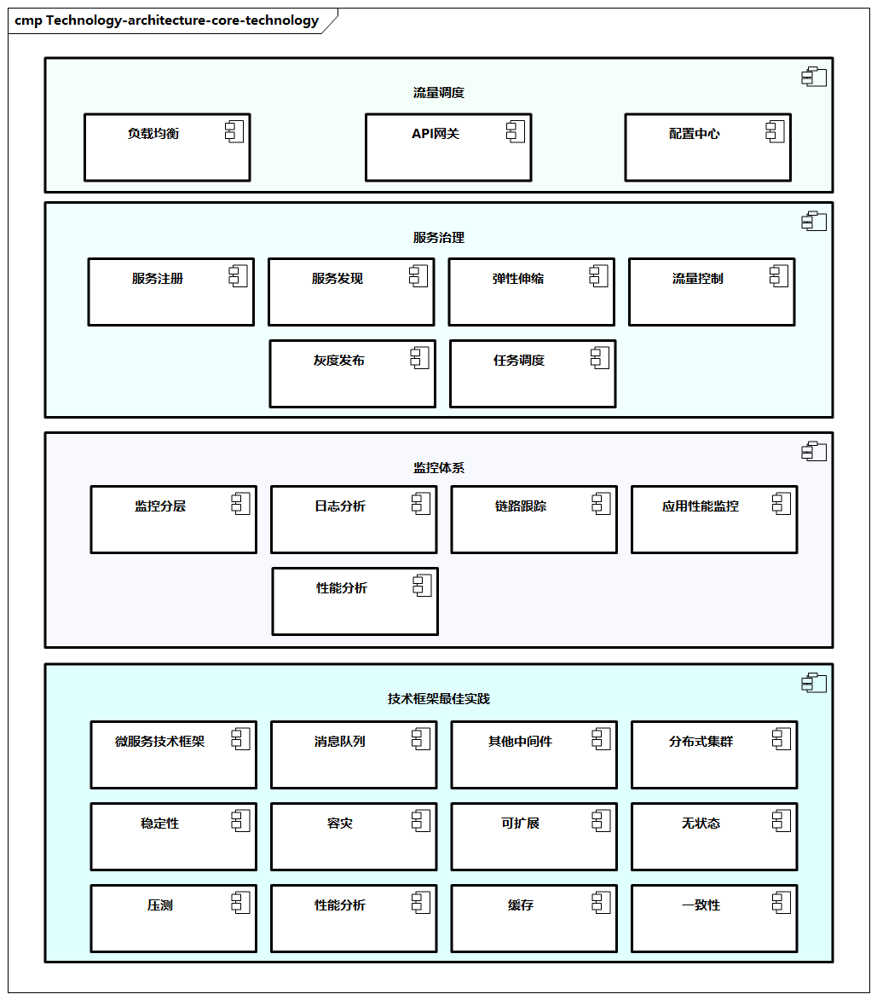
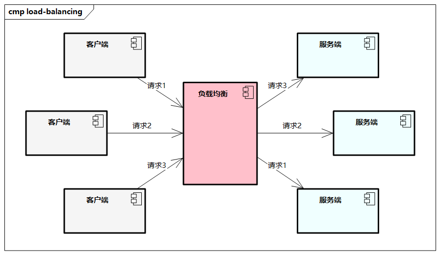
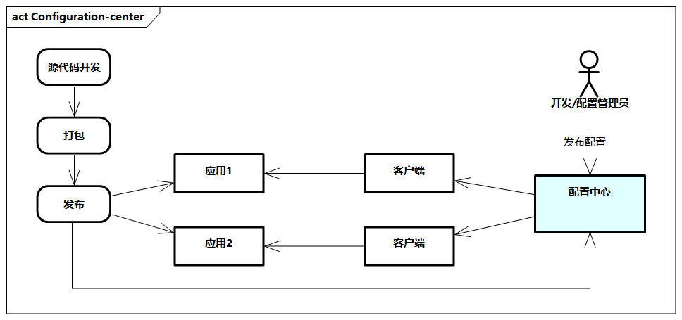
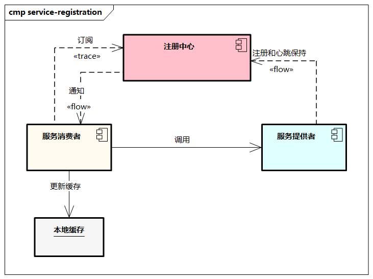
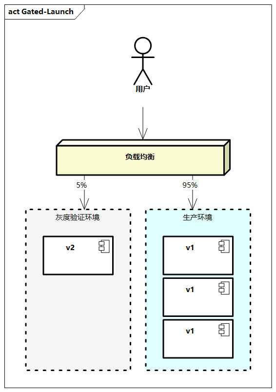
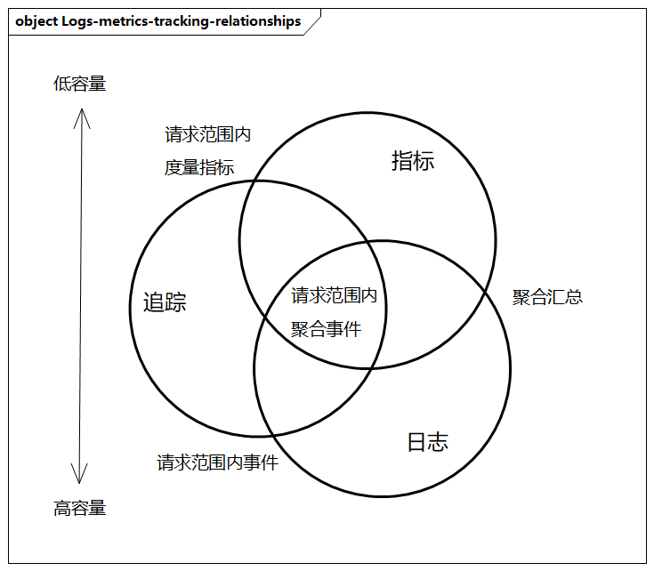
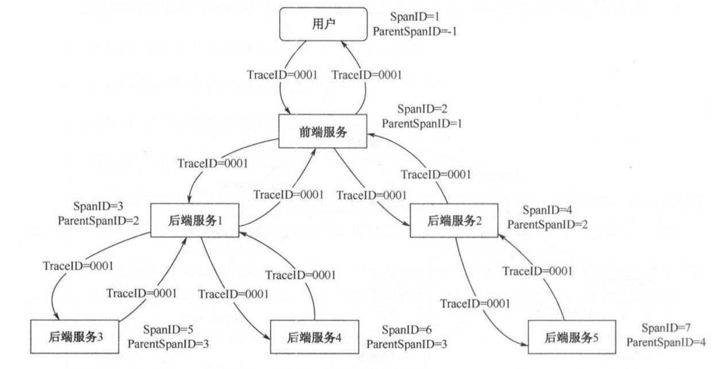
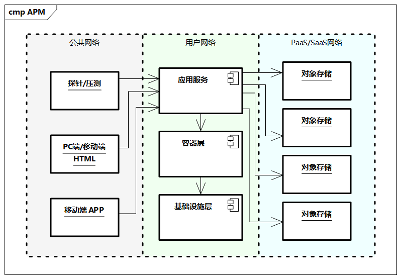
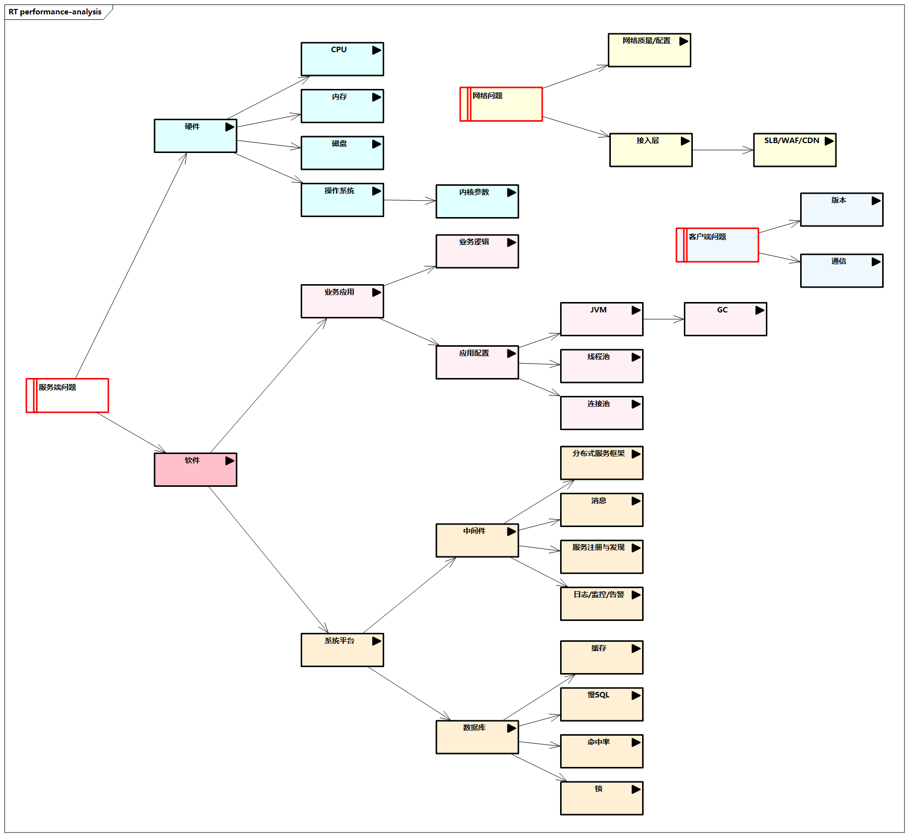
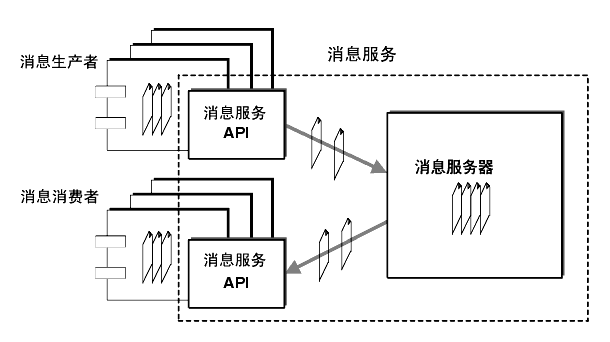

# 技术架构典型技术选型

技术架构由多种技术组成，过程中可能涉及非常多的具体技术

> 图例：技术架构核心技术

下面我们就技术架构中核心的流量调度、服务治理、监控体系、消息列队、微服务技术框架等进一步展开介绍。

## 流量调度

流量调度是技术架构中的核心技术，包括负载均衡、API网关、配置中心，以及一些高级特性，如容灾。

### 负载均衡

负载均衡（`Load Balance`）是将请求分摊到多个操作单元上执行。

来自客户端的请求通过负载均衡被分发到各个服务器，根据分发策略的不同产生不同的分发结果。

- 负载均衡不仅对流量进行了再次分配，还可以起到**类似队列的作用，作为请求和服务之间的缓冲区**，来缓解请求的压力，进而实现削峰填谷。
- 负载均衡可以**帮助扩展服务器的处理能力、增加吞吐量、提高系统的灵活性**。
- 负载均衡的**本质是对流量的管理，在系统可容纳的前提下，把资源留给最优质的流量使用，在节省成本的同时确保系统不会被冲击崩溃**。

负载均衡解决方案已经是业界比较成熟的方案，通常分为硬件负载均衡和软件负载均衡。

- 硬件负载均衡需要在服务器节点之间安装专门的负载均衡设备，常见的有交换机、F5等。
- 软件负载均衡的解决方案很多，常见的有LVS、Nginx等，我们通常会针对特定业务在不同环境中进行优化。

> 以Nginx为例，它提供一个成熟的、可扩展的、高性能Web服务器和反向代理，Nginx便于部署、配置和二次开发，并可管理授权、权限控制、负载均衡、缓存及提供应用健康检查和监控。

**负载均衡的网络消息转发一般集中在传输层和应用层**。

- 传输层在OSI七层模型中位于第四层，业界也常称之为四层负载均衡，它是**基于IP地址和端口号进行负载均衡**的，常见的有F5和LVS等产品。
- 应用层在OSI七层模型中位于第七层，因此集中在应用层的负载均衡是**基于URL和请求头等应用层信息进行负载均衡**的，常见的有Nginx，过程中还会包括SSL、Web应用防火墙等特性。

在云服务广泛使用的今天，**还有一种负载均衡的策略是把资源尽可能向消费者侧分布，这里的典型代表是内容分发网络（Content Delivery Network，CDN）**，这是一种用于内容分发的虚拟网络。依靠部署在各地的边缘服务器，CDN通过负载均衡、内容分发、调度，可以让用户就近获取所需内容，从而缓解网络拥塞，提高访问速度和命中率。

负载均衡算法有很多，大体上分为静态的和动态的两大类。

1. **静态负载均衡算法**：随机算法、轮询算法、加权轮询算法。
2. **动态负载均衡算法**：最少连接数算法、服务调用时延算法、源地址哈希算法。

### API网关

API网关一般作为后台服务的入口，企业需要特别关注，API网关主要具有以下作用。

- **门户功能**：提供统一服务入口。
- **隔离作用**：作为服务的应用边界，防止腐化。
- **解耦作用**：使微服务各方独立、自由、高效、灵活。
- **路由功能**：应对外部应用，提供前端应用的路由能力。
- **封装功能**：封装服务内部结构，为各个客户端提供API。
- **脚手架功能**：提供便于扩展的注入点，包括授权、过滤、流量控制、监控、负载均衡等。

在进行API网关设计时需要考虑如下能力。

1. 需要考虑流量调度的问题，比如如何将入口的流量路由到后段，如何从后段服务中进行负载均衡，如何将流量在多个实例间按比例或者按其他策略分发。
2. 需要考虑调用轨迹与调用监控，这样可以及时发现问题。
3. 需要考虑安全问题，要有良好的安全策略，从而把非法访问拦截在外，比如采取认证鉴权、黑白名单等。
4. 需要考虑一些流量控制手段，比如限流机制、熔断机制、流量染色等。基于此，一个良好设计的API网关内部可能由多种能力组件构成，比如服务路由组件、协议转换组件、流量控制组件、负载均衡组件、认证监控组件、数据缓存组件、超时熔断组件、自动告警组件、API网关管理台等。
5. 需要关注高可用、安全性、高性能、扩展性、服务目录管理、API全生命周期管理。

API目前设计是将RESTful作为约定规范，RESTful主要基于HTTP定义API，有以下常见的HTTP请求方法。

- **Get**：用于检索并获取位于指定URI处的资源。
- **Post**：用于在指定的URI处更新资源。
- **Put**：用于在指定的URI处创建或更新资源。
- **Delete**：用于删除指定URI处的资源。
- **Patch（Update）**：对资源局部进行更新。
- **Head**：获取资源的元数据。

其中，Post、Put和Patch很容易弄混。Post请求用于创建资源，Put请求用于创建资源或更新现有资源，Patch请求用于对现有资源的局部进行更新。Put请求必须是幂等的，如果客户端多次提交同一个Put请求，那么结果应始终相同，而Post和Patch请求没有这样的要求。

常用的API网关产品如下所示。

- [Apigee](https://cloud.google.com/apigee)：提供API管理软件，包括API平台管理、API分析、开发者工具、数据分析等。
- [Amazon API Gateway](https://aws.amazon.com/api-gateway/)：Amazon托管式服务，提供二次开发平台，让开发者创建、发布、维护、监控和保护任意规模的API。
- [阿里云API网关](https://www.aliyun.com/product/apigateway)：提供API托管服务，覆盖设计、开发、测试、发布、售卖、运维监测、安全管控、下线等API各个生命周期阶段。
- [Zuul](https://github.com/Netflix/zuul)：Spring Cloud体系中的API网关。
- [Mashape Kong](https://konghq.com/)：可扩展的开源API层工具。

### 配置中心

一般在系统的配置管理中，会有以下几个问题。

- 在分布式系统中，应用和机器的数目众多，单个应用的不同配置需要分发在多台机器上，各应用之间存在复杂的配置依赖，如系统启动时所需要的启动数据和预加载信息、数据库连接信息、连接池信息、权限管理数据、用户信息等。
- 各种配置的存储方式和版本不同，比如`XML`、`YML`、`Property`文件，注册表，数据库等。
- 在传统架构的应用发布过程中，修改一个应用配置需要将整个应用重新打包发布，过程烦琐且容易出错。

配置中心的目的就是解决上述问题，统一集中管理系统和服务的配置。

> 图例：配置中心

配置的三要素：

- 快速传播
- 变更不频繁
- 与环境相关

在配置管理的过程中，为了优化配置中心的质量，可以考虑以下方案

- 为了增加读的性能，有时使用本地缓存或者集中式缓存，不过需要注意数据的一致性；
- 为了提高实时性，企业可以使用心跳监听和定时同步的机制；
- 为了提高可用性，可以使用冗余服务、缓存等机制。

配置中心的非功能性需求是配置的安全性、实时性、动态管理、版本管理、环境与应用解耦、高可用、灵活性、可靠性、可用性、审计功能。

配置中心一般包含以下组件。

- **配置中心端**：提供配置获取、更新接口，以及动态异步推送接口，支持配置更新的实时化通知。
- **客户端**：管理客户端配置响应，比如自动Reload、动态上报等。
- **配置管理界面**：提供配置管理界面，包括配置的修改、发布等，配置存储，响应的上传、下载、更新等，以及实时通知客户端等。

常用的配置中心技术产品如下所示。

- [Nacos](https://nacos.io/en-us/)：开源技术，致力于打造一个更易于构建云原生应用的动态服务发现、配置管理和服务管理平台。目前，Nacos主要包含分布式配置中心、服务注册与发现能力。
- [应用配置管理（ACM）](https://www.aliyun.com/product/acm)：Nacos的商业化版本，是一款在分布式架构环境中对应用配置进行集中管理和推送的产品。与Nacos相比，其具备高可用与高性能、敏感配置的安全保障、支持灰度发布等。

## 服务治理

服务治理主要包括服务注册与发现、弹性伸缩、流量控制、灰度发布、任务调度等。

### 服务注册与发现

服务注册与发现指的是使用一个注册中心来记录分布式系统的全部服务信息，以便让其他服务能够快速找到这些已注册的服务。

服务注册与发现的本质是服务路由。服务路由可以分为直接路由和间接路由。

- **直接路由需要服务消费者感知服务提供者的地址信息**，比如基于配置中心或者数据库来存储目标服务的具体地址。直接路由的**缺点是消费者直接依赖提供者的地址，增加了彼此的耦合度**，同时配置中心或者数据库本身需要额外的维护成本。
- **间接路由体现了解耦的思想，本质是一种发布-订阅模式**。

> 图例：服务注册与发现示意图

- 在服务注册的过程中，**服务实例将自己的服务信息（如端口、服务名等）注册到服务注册中心**，服务注册中心将服务信息及服务健康状态通过API暴露出来。
- **服务消费者通过服务注册中心获取到服务实例信息，去请求服务提供者提供服务**。当服务地址发生变化时，服务注册中心将服务变化推送给服务消费者，同时服务消费者会配置缓存机制以加速服务路由，特别是当服务注册中心不可用时通过本地缓存实现服务的可靠调用。
- 此外，服务注册与发现还需要**对服务实例的健康状态进行实时监控**，当服务实例不可用时，将通知各服务消费者移除无效服务实例。
- 另外，一个服务可能存在多个服务实例，需要根据**不同的负载均衡算法来保持均衡**。

服务发现主要包括以下组件。

- **服务注册中心**：进行服务注册、销毁等。
- **服务发现组件**：服务目录查询、服务地址查询。
- **本地服务缓存库**：一般在客户端，暂时缓存获取的服务信息。
- **注册中心服务存储库**：存储服务信息，如KV存储服务配置信息。
- **服务管理平台**：后台管理服务集群的状态，监控服务异常，检查服务注册信息，进行统计分析等。

服务注册与发现需要考虑以下因素。

- **高可用问题**：服务注册中心需要保持7×24小时的稳定运行，特别是当新增、移除服务时应避免对其他服务造成影响，同时需要消除单点故障，采用数据库持久化和服务集群方式。
- **数据一致性**：注册中心的节点维护已注册的服务列表，同一份数据不能出现读写数据不一致的情况。
- **实时性**：对注册的服务进行心跳检测，确保在注册中心的服务信息是实时的、准确的，如有数据变更及时通知服务消费者。
- **高性能**：服务提供者根据不同的算法来平衡负载。
- **监控性**：提供监控负载能力，监听注册中心服务器的状态、资源情况、负载程度。
- **兼容性**：比如与其他组件的兼容能力，提供统一的注册中心，如[Dubbo](https://dubbo.apache.org/)、[Spring Cloud](https://spring.io/projects/spring-cloud)、[Kubernetes](https://kubernetes.io/)、[Service Mesh](https://istio.io/latest/about/service-mesh/)等。

对于常见的服务注册与发现技术组件，业界已经有了很多成熟的方案。

- [DNS](https://en.wikipedia.org/wiki/Domain_Name_System)：最早的服务发现实现，适用于小规模单体应用，如[Spotify](https://engineering.atspotify.com/2013/02/in-praise-of-boring-technology/)([中文链接](https://www.infoq.cn/article/2013/03/spotify-on-boring-technologies))。
- [Eureka](https://spring.io/projects/spring-cloud-netflix)：Spring Cloud体系，自定义构建，具有最终一致性，Java体系。
- [Nacos](https://nacos.io/en-us/)：除了具备配置中心能力，也提供服务注册与发现的能力。
- [Zookeeper](https://zookeeper.apache.org/)：通用注册中心能力，配置存储方案，Java体系。
- [Consul](https://github.com/hashicorp/consul)：支持跨数据中心，具备KV模型存储和健康检查能力。

### 弹性伸缩

**弹性伸缩指的是在分布式集群中，通过服务探针、监控应用、服务状态，以及一些系统的指标，根据指定的规则自动调整服务实例的数量**。

> 在传统的方式中，如果需要增加机器资源，需要找运维人员申请机器，然后部署好软件服务接入集群，整个过程依赖的是运维人员的自身经验，容易出错。比较理想的方式是通过一定的机制和工具，辅助我们自动进行弹性伸缩。

在弹性伸缩中，有**两个核心，即扩容和缩容**。

- 扩容指的是在监控到服务容器出现瓶颈，包括负载、CPU、RT指标紧张时，能够自动将服务实例增加到集群中。
- 缩容指的是在监控到服务容器负载减少，出现资源浪费时，自动释放服务实例，从而降低成本。

在扩容和缩容的过程中，需要结合很多服务的信息，充分结合应用的入口流量进行控制，让系统的入口流量和系统的负载达到一个平衡，一些扩容和缩容的指标参考如下。

- **Load**：当系统Load超过阈值，并且系统当前的并发线程数超过预计的系统容量时触发。
- **CPU使用率**：当系统CPU使用率超过阈值时触发。
- **RT**：当单台机器上所有入口流量的平均RT达到阈值时触发。
- **线程数**：当单台机器上所有入口流量的并发线程数达到阈值时触发。
- **入口QPS**：当单台机器上所有入口流量的QPS达到阈值时触发。

在弹性伸缩的过程中，需要**密切关注系统的稳定性**，系统能够稳定地处理潜在的故障并从故障中恢复。在分布式系统中，瞬态和更永久性故障都是有可能的。为了保持弹性，必须快速、有效地检测故障并进行恢复，比如隔离、重试、限流降级、故障恢复等。

### 流量控制

流量控制（`Flow Control`）简称流控，根据流量、并发线程数、响应时间等指标，把随机到来的流量调整成合适的形状（流量塑形），从而提高系统的高可用防护能力。流控可能包括系统的不同层次，比如对网关入口、应用级别、服务依赖、系统资源等各个方面加以控制。

**流控的根本目的是高可用**，大型分布式系统对高可用有很高的要求，客户始终希望系统能提供7×24小时不间断服务。高可用（`Availability`）的计算公式如下所示。

> Availability = MTTF/(MTTF + MTTR)

影响系统可用性的指标主要有两个：

- `MTTF`（`Mean Time to Failure`，不出故障的时间）
- `MTTR`（`Mean Time to Recovery`，出故障后的恢复时间）

因此要提高系统的可用性，可以从两个方面入手：

1. 尽量增加无故障时间
2. 尽量缩短出故障后的恢复时间

业界通常用N个9来量化可用性，如“4个9（也就是99.99%）”的可用性，也就是，一年下来网站不可用时间约为53分钟（也就是不足1小时）。

|可用性(通俗叫法)|可用性比率|年度停机时间|
|:---|:---|:---|
|2个9|99%|87.6小时|
|3个9|99.9%|8.76小时|
|4个9|99.99%|53.6分钟|
|5个9|99.999%|5.36分钟|

分布式系统是由不同组件构成的，包括复杂均衡、应用、缓存、消息、配置、数据库、存储、基础设施等；每个组件又有不同的技术，比如分布式应用可以使用`SpringCloud`、`Dubbo`或者`HSF`；每种技术又有自己的特点，如性能、自动扩展、恢复、容灾。

总体来说，从流量控制角度，提高高可用的方法可以大致分为冗余、自愈、限流、降级等。

1. **冗余**。提升高可用**最主要的方法是冗余，增加机器，分担压力，降低风险**。同一服务部署在多台服务器上；同一数据存储在多台服务器上互相备份。当任何一台服务器宕机或出现不可预期的问题时，就将相应的服务切换到其他可用的服务器上。这样，即使单个机器出现问题，也不影响系统的整体可用性，从而保证业务数据不丢失。

    - 冗余的方式可以是双机或集群。
      - 双机有主备、主从和双主模式
      - 集群在双机的基础上，增加了备机、从机或其他主机的个数（比如一主多从、一主多备、多主等）
    - 冗余高可用的关键点是考虑多机器之间的数据复制、状态检测、调度分配、选主切换等。

2. **自愈**。自愈主要体现在**系统出现问题时，系统快速恢复，不影响业务的可用性**。自愈通用的方式是超时、重试、回滚、数据恢复等。

   - **超时**：当调用服务时，调用方不可能无限制地等待提供者接口的返回，一般会设置一个时间阈值，如果超过了时间阈值，就不再继续等待。
   - **重试**：超时时间的配置是为了保护调用方，避免因为服务提供者不可用而导致调用方也不可用。但也有可能提供者只是偶尔“失灵”，在这种场景下，我们可以在超时后重试一下，保证服务的正常调用。重试需要考虑两个方面：一方面，可以采取一些策略，比如考虑切换一台机器来调用，避免原机器出现性能问题；另一方面，需要考虑幂等，即同一个请求被客户多次调用，对“失灵”产生的影响（这里的影响一般指某些与写入相关的操作）是一致的，而且这个幂等应该是服务级别的，而不应是某台机器层面的，重试调用任何一台机器，都应该做到幂等。
   - **回滚**：通过版本控制进行稳定版本的回滚恢复，包括应用回滚、基线回滚、版本回滚等。在应用回滚之前需要保护好故障现场，以便排查原因；在应用回滚后，代码基线也需要回到前一版本。整体回滚需要服务编排，通过大版本号对集群进行回滚。
   - **数据恢复**：在故障发生后，系统保证数据不丢失。比如数据节点从一台机器切换到另一台，需要保证节点之间的数据一致。当然根据实际业务高可用的SLA，可以保证最终一致，比如在主备数据复制过程中，允许短暂的主备数据不一致，但最终保证一致性。数据恢复有时对机器磁盘有要求，比如尽量做RAID（磁盘阵列），使用SSD/SAS，保证容量充足，避免因硬件因素造成数据丢失。

3. **限流**。**限流类似于我们日常生活中的排队**，比如在上下班高峰期的地铁站，上班族通过“蚊香”式排队等待地铁。**限流的策略可分为限制访问的绝对数量和控制流速**。限制总数可通过设置规则来实现，目前**常见的限流算法有计数器限流算法、漏桶算法和令牌桶算法**。在分布式系统中，限流可通过服务限流和资源隔离等方式实现。

   - **服务限流**：为了保护系统应用提供者，监控入口流量的QPS或线程数，当达到阈值时立即拦截流量，以避免被瞬时的流量高峰冲垮，从而保障应用的高可用性。在限流后可以采取以下方式：直接给调用方返回缓存、固定数据或直接拒绝；需要实时写入数据库的，先缓存到队列里，后续或异步写入数据库。
   - **资源隔离**：隔离是对问题故障的有效控制，可以防止故障恶意扩散。类似于病毒隔离，在分布式系统中，可以通过不同角度进行隔离，可以是机器角度，分为线程、进程、容器、单机、集群、分区等；也可以是功能角度，比如读写隔离等。

4. **降级**。限流主要从应用服务提供者的角度进行保护，而**降级主要从应用服务调用者的角度进行保护**，因为调用者可能依赖后端很多服务，但有可能某一个服务经常异常、超时或出现数据错误，为了保护调用者，则对有异常的提供者进行降级。降级的具体实施既可以是代码自动判断，也可以是人工根据突发情况切换，一般可采用关闭非核心服务、降低一致性约束、简化功能等方式。具体地，降级可分为依赖降级和熔断降级。

   - **依赖降级**：调用者**监控到下游依赖异常（如响应时间、错误率），并且达到指定的阈值，立即降低下游依赖的优先级，采用备用逻辑（如错误页面、固定返回值），避免应用受到影响**，从而保障应用的高可用性。在此过程中，建议**集中管理降级开关，并尽量前置化**。
   - **熔断降级**：熔断降级是**在依赖降级的基础上执行的，当服务提供者调用大量服务超时或失败时，应该熔断该服务的所有调用，并且将后续调用服务直接返回，从而快速释放资源**，确保在目标服务不可用的这段时间内，所有对它的调用都为立即返回。**熔断降级可以理解为依赖降级的升级，是系统可用性的“保险丝”**。
     - 熔断可分为三个状态：
       - 第一，**Closed（闭合）状态**，这是正常状态，系统需要一个基于时间线的错误计数器，如果错误累计达到阈值则切换至Open状态
       - 第二，**Open（断开）状态**，对所有服务请求立即返回错误，不用调用后端服务进行计算
       - 第三，**Half-Open（半开）状态**，允许部分请求流量进入并进行处理，如果请求成功则按照某种策略切换到Closed状态。
     - 熔断的**设计要点是需要定义错误类型、有标准的日志输出、有服务诊断及自动恢复能力、设置开关（用于三种状态的切换）**、做到业务隔离。

在流量控制的过程中，需要**把握一个总体原则，即“恢复业务优先原则”**。线上业务故障，需要优先恢复业务，再分析问题。**如果系统不能自动恢复，则应想尽一切办法进行限流、隔离或降级，比如下线有问题机器，对问题业务进行降级或资源隔离，在恢复业务后，再进行信息搜集（如日志、堆栈、抓包、截屏等），后续分析根因并优化系统**。

为了更自动化地进行流量控制，可以构建统一的服务治理平台，一般包含以下几个部分。

- **服务管理平台**：比如管理服务依赖，通过关系图的形式展现，涉及相关的负责人，服务上下线的审批管理，服务的SLA管理，调用统计，白名单管理等。
- **服务稳定性平台**：比如冗余、自愈、限流、降级等相应的配置，流量控制的分流管理，请求堆积的处理，通过熔断配置防止服务雪崩等。
- **稳定性故障演练**：比如全链路压测、大促秒杀活动、稳定性预案处理，在特殊情况下，还需要做一些故障演练、快速恢复等稳定性综合能力建设。故障大概可以分为依赖服务故障（如依赖的中间件、数据库、缓存等实施一些网络丢包、网络延时）、应用层故障（应用本身故障，如宕机、假死、重启等）、系统层故障（如系统CPU、内存、磁盘、网络）等。

流量控制常用的一些技术如下所示。

- [Sentinel](https://github.com/alibaba/Sentinel)：开源限流系统，基于QPS限流，支持多种降级策略和数据源类型，系统自适应保护，支持控制台。
- [Hystrix](https://github.com/Netflix/Hystrix)：Spring Cloud体系，基于线程池和信号量隔离，提供简单的控制台能力。
- [Resilience4j](https://github.com/resilience4j/resilience4j)：基于信号量隔离，通过Rate Limiter模型限流，不提供控制台能力。
- [AHAS](https://www.aliyun.com/product/ahas)：Sentinel的商业化版本，专注于提高应用及业务高可用的工具平台，提供应用架构探测感知、故障注入式高可用能力评测和流控降级高可用防护三大核心能力。

### 灰度发布

在分布式系统中，发布非常频繁，其中**灰度发布是一种发布策略**，其让我们的发布按照一定的策略和节奏进行。灰度发布技术适用于两个不同版本同时在线上并行的场景，既可用于业务试错，也可用于版本发布。

灰度发布需要解决两个方面的问题：

- 一是多版本部署，分为客户端部署和服务端部署
- 二是流量切分，包括入口流量切分（服务器权重、IP地址段或用户标签）和服务流量切分（服务发现机制、植入流量切分规则、控制流量方向）


> 图例：灰度发布示意

灰度发布是一种部署策略，从不同版本发布节奏及流量状态方面，我们也常用一些其他的术语来表达，比如停机部署、滚动发布、蓝绿部署、A/B测试等，这些术语有所不同，这里不做详细说明，但本质都是对不同版本应用服务升级的部署策略。

### 任务调度

任务调度是分布式系统不可缺少的一个环节，传统的方式是在Linux机器上配置定时任务或者直接在业务代码里面完成调度业务，现在多用成熟的中间件来代替。

任务调度需要支持灵活的任务处理能力，定时的调度器，比如Cron规则、固定延迟、时区、日历等；支持可视化的任务编排，解决任务有前后依赖的情况；支持多种语言（如Java、Python），同时支持静态分片，提供Java动态分片，支持失败自动重试，还可以在控制台手动原地重试，并且具备丰富的报警功能，比如任务失败报警、超时报警、服务缺失报警。

一些通用的任务调度中间件如下所示。

- [Spring Batch](https://spring.io/projects/spring-batch)：Spring体系的轻量级批处理框架，支持记录/跟踪、事务管理、作业处理统计、作业重启和资源管理。
- [SchedulerX](https://www.aliyun.com/aliware/schedulerx)：阿里巴巴自研的基于Akka架构的新一代分布式任务调度平台，具有高可靠、秒级调度及可运维等能力。

## 监控体系

### 监控分层

分布式系统是由多个机器共同协作的，同时网络无法保证时刻可用，因此需要建设一套能够监控的系统，从底层到业务各个层面进行监控，并基于监控及时修复故障。监控一般包括收集、处理和汇总，并且显示关于某个系统的实时量化数据，如请求的数量和类型、错误的数量和类型，以及处理用时、应用服务器的存活时间等。

从监控能力层次上，一般我们可以从以下方面对系统进行监控。

- **基础监控**：基础监控是对容器资源的监控，包含各个硬件指标的负载情况，比如CPU、I/O、内存、线程、吞吐量等。
- **中间件监控**：如中间件、缓存、数据库等组件的相关QPS、RT、成功率等。
- **服务监控**：比如应用的性能监控，对核心应用服务的实时指标（QPS、RT、成功率、异常数）、上下游依赖等进行监控，以及监控服务画像、服务拓扑关系、服务调用链、版本信息、服务组件内部状态等。
- **业务监控**：除了应用本身的监控程度，业务监控也是保证系统正常的关键。企业可以根据业务规则对异常情况做报警设置，基于日志、异常、错误码Top N等统计和告警；或者进行业务层面的统计，比如分钟级下单数量。
- **数据监控**：基于数据查询、数据一致性和稳定性的监控，包括超时、积压、资损对账等方面，确保业务和应用数据层面的稳定和一致。

**日志（Logging）、指标（Metrics）、追踪（Tracing）是监控体系的核心元素。**

- **日志**：描述的是一些不连续的离散事件，包括日志采集、日志分析和告警通知。例如，有些业务系统采用ELK（Elasticsearch+Logstash+Kibana）或类似技术栈的日志收集系统，它们是分布式监控系统的早期形态，借鉴了传统的解决问题方式。
- **指标**：可以累加，具有原子性，包括指标监控、健康检查和告警通知。每个指标都有一个逻辑计量单元，体现了一段时间内相关指标的状态。
- **追踪**：也就是分布式调用链路，指在单次请求范围内处理信息，数据和信息都被绑定到系统的单次链路上，包括分布式调用和告警通知。调用链路近年来格外受人们关注。

日志、指标、追踪的关系如图7-15所示。这三个概念并不是相互独立的，往往一个监控体系都会涉及一些。**APM（应用性能管理）系统便是三者一体化的解决方案**，充分理解三者的关系，可以更好地理解监控的本质，以及更好地定位开源和商业化监控工具。

监控系统的一些通用原则如下所示。

1. **关注业务黄金指标**：比如延迟、流量、错误、饱和度，以及相关的QPS、成功率、RT。
2. **留意系统基础指标**：系统基础指标包括CPU、Load、内存、流量、网络丢包、重传率、磁盘I/O等，以及JVM的GC次数和时间、Java线程数、Java堆内存使用情况等。
3. **告警阈值设计合理**：监控系统信噪比高，发出紧急警报的组件简单且可靠，可以防止大量无效告警。
4. **简化监控告警**：监控规则应该越简单越好，可预测性强，非常可靠。
5. **监控系统长期优化**：随着业务系统和架构的升级，需要对监控系统进行相应的优化。

基础监控常用的技术工具如下。

- [Zabbix](https://www.zabbix.com/)：基于Web界面的分布式系统监视及网络监视功能，提供企业级开源解决方案。
- [Newrilic](https://newrelic.com/)：提供功能Rails性能检测服务的网站，提供不同级别的监测功能。
- [Tsar](https://github.com/alibaba/tsar)：系统信息跟踪工具，主要用来收集服务器的系统信息（如CPU、I/O等）及应用数据（如Squid、Haproxy、Nginx等）。

### 日志分析

企业系统每天会产生海量日志，日志信息增长迅速。为了解决信息存储容量、数据安全、日志搜索分析等问题，需要分布式日志监控系统来进行发掘、分析、判断并形成定性或定量描述。

日志系统一般需要包含以下组成部分。

- **日志收集**：收集各类日志，发送到日志中心，并形成不同类型的日志。
- **日志缓冲**：不同类型的日志需要有不同的目录空间，形成不同的主题。
- **日志处理**：对从原始数据到检索格式进行转化，从日志中抓取关键字，判断并写入索引中。
- **日志存储**：存储到数据库中，并对存储结构进行定义。
- **日志展示**：UI展示日志统计、查询结果等。

一些常用的日志分析工具如下。

- [Elasticsearch](https://www.elastic.co/elasticsearch)：ELK组成之一，是基于Lucene的搜索服务器，提供一个分布式多用户的全文搜索引擎，基于RESTful Web接口。
- [Logstash](https://www.elastic.co/logstash)：ELK组成之一，是一个应用程序日志和事件传输、处理、管理和搜索的平台，可以统一对应用程序日志进行收集和管理，并提供统一接口查询。
- [Kibana](https://www.elastic.co/kibana)：ELK组成之一，是一个开源的分析和可视化平台，提供搜索、查看，并与存储在ES中数据进行交互，以及提供各种图标、表格和地图等工具。

### 链路追踪

针对分布式系统复杂的调用链路，如何快速、准确地定位服务异常位置？如何跟踪处理结果？如何将技术与业务异常高效结合？这需要分布式调用链路的监控。

分布式调用链路把调用过程记录下来，关注各个调用的性能指标，比如吞吐量、响应时间及错误记录等。调用链路从整体维度到局部维度展示各项指标，将跨应用的所有调用链性能信息集中展现，方便度量整体和局部性能，找到故障产生的原因，缩短故障排查时间。

在链路追踪的历史中，关键事件是2010年Google Dapper论文的发表，之后各个厂商依据Dapper纷纷研发了自己的调用链监控工具，比如携程的CTrace，韩国公司Naver的PinPoint，Twitter的Zipkin，阿里巴巴的Eagleye，京东的Hydra。接着产生了调用链监控的标准规范[Open Tracing](https://opentracing.io/)，目的是通过兼容、统一的API来进行链路追踪，Uber的Jaeger、Apache SkyWalking也均符合Open Tracing规范。

调用链每个请求生成一个全局TraceID，通过TraceID可以连接起整个调用链。此外，SpanID用于记录调用复杂关系，整个调用过程中每个请求都要透传TraceID和SpanID。所有这些ID可用全局唯一的64位整数表示。每个服务将该次请求附带的TraceID和附带的SpanID作为Parent ID，并且记录自己生成的SpanID。要查看某次完整的调用只要根据TraceID查出所有调用记录即可。

> 图例: 调用链示意图

一个通用的链路处理，一般采用这样的架构和技术组件。整个过程是对调用链数据定义、生成、采集、计算、存储的过程。

> 图例: 通用的调用链组件架构
>
> 比如采用ELK和HBase，通过Agent生成调用链日志，通过Logstash采集日志到MQ；MQ负责提供数据给下游消费，Storm计算汇聚指标交给Elasticsearch，Logstash将MQ的数据明细给到HBase中，根据TraceID作为行键进行快速查询。

常用的链路最终方案如下所示。

- [Zipkin](https://zipkin.io/)：Twitter公司的Zipkin是Google Dapper的开源实现，采用Scala编写，集成到Twitter的分布式服务Finagle中，涵盖信息的收集、处理和展现。
- [Pinpoint](https://pinpoint-apm.github.io/pinpoint/)：Naver开源的Pinpoint是一款用Java编写的大规模分布式调用链系统，追踪每个请求的完整调用链路，收集性能数据，支持大规模服务器集群。

### 应用性能监控

`APM`的全称是`Application Performance Management`，指的是对应用程序的性能和可用性的监控管理。

- 狭义上的APM单指应用程序的监控，如应用的各接口性能和错误监控，分布式调用链路跟踪，以及其他各类用于诊断（内存、线程等）的监控信息等
- 广义上的APM除了包括应用程序的监控，还包括移动端App监控，页面端监控，容器、服务器监控，以及其他平台组件（如数据库）等层面的监控

APM是伴随着云技术、微服务架构发展起来的一个新兴监控领域。

> 在国内外，无论是开源的Apache SkyWalking、云厂商（如AWS、Azure等），还是独立的公司（Dynatrace、Appdynamics等），都有着非常优秀的APM产品，比如阿里云的ARMS。

目前，人们对APM的要求越来越高，比如分布式追踪、非侵入式的语言探针、轻量化、低延时分析，这些是对APM提出的进一步要求。

展示了APM的主要能力，一般包括以下几项。

- 应用一般对外提供两种客户端访问模式：移动端App访问，基于浏览器的页面访问。
- 部署相应的业务探针，通过API来直接测试服务性能或进行健康检测。
- 对客户端直接提供服务的为后端应用服务程序。
- 后端应用一般运行在容器里，进一步使用容器技术来优化开发和运维。
- 应用还会直接依赖各类的PaaS/SaaS云服务，对应用提供相应平台服务，从而简化应用的运维成本。

### 性能分析

分布式系统的性能指标，一般包括以下几个方面。

- 从广义上来讲，可能有多个方面，比如**QPS、高可用（如99.99%）、响应时间、客户体验、数据一致性、可扩展性、容错性**等；
- 从狭义上来讲，我们常用业务QPS来表达系统性能，**即在满足一定客户体验的前提下，在一定机器资源环境下，系统所能够承载的最大业务处理能力，通常用每秒处理的事务数QPS来表示**。

性能优化是一个系统工程，是**无止境**的，需要有明确的目的和思路，并结合实际的业务来进行，这里给出一些通用的参考。

- **梳理业务目标**：重点分析核心的业务流程和应用功能，比如秒杀大促、交易链路等的GMV（商品交易总额）、DAU（日活跃用户数量）、订单数等。不同的业务目标，系统所承载的压力不同。
- **梳理系统架构**：总体把控系统架构，比如产品、组件、组网、技术选型等多方面架构。
- **确定性能问题**：明确要优化的问题及其指标，比如QPS、RT。
- **确定优化目标**：明确现状和目标。
- **确定解决方案**：方案可能有多种，需要综合分析各方案的优缺点，多方评审和讨论并选择一个，比如可以有如下的优化思路：
  - 从**拆分**角度，可以有垂直拆分、水平拆分、分库分表、读写分离；
  - 从**QPS**角度，可以有异步化、批量化、拆分；
  - 从**高并发**角度，可以有伸缩扩容、拆分、异步、缓存、限流降级；
  - 从**可扩展**角度，可以有无状态设计、伸缩、拆分等。
- **测试解决方案**：综合测试方案，为整个应用程序创建性能测试套件。
- **分析调优结果**：综合分析，调优也是个循环过程，逐步优化，达到目标。

从技术角度，性能问题可能发生在系统的网络、服务端（基础设施、操作系统、中间件、数据库）、客户端，可以采用如图7-19所示的方法。

- **网络**：一般指的是防火墙、动态负载均衡器、交换机等设备。很多情况是因为网络不同，比如SLB、WAF、CDN加速，VPN等配置问题，或者更为粗暴的网络光缆切断。
- **客户端**：主要是客户应用与服务端的版本或通信问题。
- **服务端**：分布式系统大部分问题发生在服务端。
  - 在硬件层面，比如基础设施中常见的CPU满、内存满、磁盘满，操作系统的参数配置等。
  - 在软件层面，
    - 一是**业务应用问题**，主要是**业务逻辑**（多数情况是程序本身设计问题，比如大对象调用、多层嵌套循环、串行处理、请求的处理线程不够、无缓冲、无缓存）和**应用配置**问题（JVM、线程池、连接池配置不足）；
    - 二是**系统平台问题**，比如中间件方面的服务框架、消息异步设计、服务注册与发现性能、日志采集异常等，以及数据库的缓存、SQL等配置优化（如`JDBC`）。

> 图例：性能优化分析方法

性能优化的一些通用工具如下。

1. **压力测试工具JMeter**。JMeter是Apache组织开发的基于Java的压力测试工具。它可以用于测试静态和动态资源，如静态文件、Java服务程序、CGI脚本、Java对象、数据库、FTP服务器等。JMeter可用于对服务器、网络或对象模拟巨大的负载，在来自不同压力类别下测试它们的强度和分析整体性能。另外，还可以尝试阿里云的SaaS性能测试平台PTS，简化业务场景的构建，为性能问题定位、容量最佳配比、全链路压测的流量构造提供帮助。
2. **Dapper调用链分析**。分布式系统中的服务很多，也有很多跨进程、跨线程的场景，汇总收集并分析海量日志尤为重要。分布式调用链分析的目的是追踪每个请求的完整调用链路，收集调用链路上每个服务的性能数据，计算性能数据并比对性能指标，甚至在更远的未来能够反馈到服务治理中。相关的调用链分析可参考前文，比如EagleEye工具。
3. **Arthas应用在线诊断工具**。Arthas是阿里巴巴中间件团队基于Greys开发的全新在线诊断工具，采用命令行交互模式，使得在定位、分析、诊断问题时看每一个操作都非常便捷，可以跟踪到每一行代码的执行时间，有助于查找定位系统的性能瓶颈。
    - `Dashboard`——当前系统的实时数据面板。
    - `Monitor`——方法执行监控。
    - `Trace`——方法内部调用路径，并输出方法路径上的每个节点上耗时。
    - `Stack`——输出当前方法被调用的路径。
    - `tt`——方法执行数据的时空隧道，记录下指定方法每次调用的入参和返回信息，并能对这些不同的时间下调用进行观测。

## 消息队列

分布式消息队列系统是**消除异步带来一系列复杂步骤的一大利器**，通过消息队列**既可以解耦系统，又可以削峰填谷**等。在消息服务中，消息是由生产者创建的数据，并且会被分发出去，由消费者接收并进行进一步处理。

生产者和消费者之间通过消息代理（又称消息传递中间件）进行通信。

> 图例：消息服务示意图

消息队列使用的应用场景如下所示。

- **削峰填谷**：诸如秒杀、抢红包、企业开门红等大型活动时皆会带来较高的流量脉冲。
- **异步解耦**：交易系统中每笔交易订单数据的产生会引起数十个或者上百个下游业务系统的关注，包括物流、购物车、积分、流计算分析等，整体业务系统庞大且复杂，通过消息服务实现异步通信和应用解耦，确保主站业务的连续性。
- **顺序收发**：企业中需要保证顺序的应用场景非常多，例如证券交易过程的时间优先原则，交易系统中的订单创建、支付、退款等流程，航班中的旅客登机消息处理等。顺序收发与先进先出（First In First Out，FIFO）原理类似。
- **分布式事务一致性**：交易系统、支付红包等场景需要确保数据的最终一致性，大量引入消息队列的分布式事务，既可以实现系统之间的解耦，又可以保证数据的最终一致性。
- **大数据分析**：数据在“流动”中产生价值，传统数据分析大多基于批量计算模型，而无法做到实时的数据分析，将消息队列与流式计算引擎相结合，可以实现业务数据的实时分析。

从技术角度，消息服务具备高性能、高可用、高可靠等特点。

1. **高性能**：消息发送方将耗时较长且无须实时处理的操作封装为消息，并将消息发送给消息队列服务。发送方无须等待消息被消费方处理完，就可以继续做其他事情，从而提高性能。
2. **高可用**：消息队列服务及集群的方式部署，常见的有一主多备或双主双备等。当一台消息队列服务“挂掉”后，另一台消息备份服务可以及时对外提供服务。
3. **高可靠**：消息队列服务提供了极高的可靠性，保证消息集群可靠和稳定，同时可以通过进一步的服务幂等性，进一步提高整体的可靠性。此外，消息队列服务会执行消息的持久化，包括同步双写和异步复制，保证了数据的高可靠性。

一些常见的消息队列技术或产品如下。

- [Kafka](https://kafka.apache.org/)：由Scala编写的分布式、分区的、多副本的、多订阅者的分布式MQ系统，可用于Web/Ngnix日志、搜索日志、监控日志、访问日志等，具备提供消息的持久化、高吞吐量等特点。
- [RabbitMQ](https://www.rabbitmq.com/)：由Erlang开发的高级消息队列协议（AMQP）的开源实现，具备可靠性、灵活路由、消息集群、高可用、多种协议等特点。
- [RocketMQ](https://rocketmq.apache.org/)：基于Apache RocketMQ构建的低延迟、高并发、高可用、高可靠的分布式消息中间件，支撑千万级并发、万亿级数据洪峰。
- [ActiveMQ](https://activemq.apache.org/)：Apache下开源项目，支持多语言Client，支持JMS和J2EE规范、支持多种传输协议，支持Spring、Ajax、Axis等的整合。
- [IBM MQ Series](https://www.ibm.com/products/mq)：广泛应用在硬件和软件平台，提供确定、异步、一次性数据发送的通信系统。
- [Microsoft MQ](https://learn.microsoft.com/en-us/previous-versions/windows/desktop/msmq/ms711472(v=vs.85))：微软消息队列，提供应用间互相通信的异步传输服务。
- [ZeroMQ](http://zeromq.org/)：一个开源的高性能、异步、分布式的消息队列，支持多种语言，具备高性能、可靠性、可扩展性等特点。

## 微服务技术框架

微服务框架本身是一个体系的框架，包括负载均衡、配置管理、服务注册与发现、服务安全、分布式监控、流量调度与容错、弹性伸缩、任务调度等多方面，一个稳定的微服务框架可以简化开发管理和技术选型，一些常用的微服务框架如下。

- [Spring Cloud](https://spring.io/projects/spring-cloud)：基于Spring Boot实现的应用开发工具，提供微服务开发所需的配置管理、服务发现、断路器、路由、微代理、控制总线、全局锁、决策竞选、分布式会话和集群状态管理等组件，是微服务框架的标准。它由很多子项目组合而成，应用开发者可以根据自己的需求灵活地将各种组件搭配使用。Spring Cloud遵循如下设计理念：约定优于配置，建议在熟悉的约定前提下，简单、标准化地构建应用；提供声明式的元注解配置方式，屏蔽组件具体的实现复杂度；提供丰富的组件，比如与大量的服务治理相关的组件，同时相对中立，有不同的实现方案；灵活的解耦。各种服务组件完全解耦，企业可根据需要灵活组合和替换。
- [Netflix](https://spring.io/projects/spring-cloud-netflix)：是对Spring Cloud框架的一种实现，包括服务注册与发现框架Eureka、API网关Zuul、服务端框架Karyon、客户端框架Ribbon、服务容错组件Hystrix、配置中心Config/Vault、服务容错Hystris、分布式追踪Sleuth等。
- [Spring Cloud Alibaba](https://spring.io/projects/spring-cloud-alibaba)：也是对Spring Cloud框架的一种实现，比如服务发现与配置管理Nacos、限流降级Sentinel、分布式消息系统RocketMQ、分布式事务Seata、动态追踪工具Arthas等。
- [Dubbo](https://dubbo.apache.org/)：Alibaba开源的分布式服务框架，基于RPC方式，基于分布式服务调用简化服务提供方和调用方的开发，同时具有注册中心、协议支持、服务监控等能力。
- [企业级分布式应用服务（Enterprise Distributed Application Service，EDAS）](https://www.alibabacloud.com/product/edas)：是一个应用托管和微服务管理的云原生PaaS，提供应用开发、部署、监控、运维等全栈式解决方案，同时支持Spring Cloud和Dubbo等微服务运行环境。
