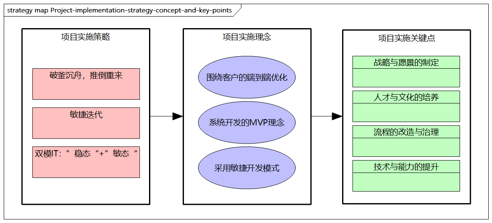

# 项目实施管理

## 项目实施策略

企业数字化项目的实施有两种策略。

### 第一种是破釜沉舟，推倒重来策略

这种策略适合在企业数字化建设非常陈旧，现有系统改动非常困难，已经严重制约了业务发展，“牵一发而动全身”时采用。

**这种策略要求企业高层对数字化有强烈的转型动力，但此策略风险比较高，是一种破釜沉舟的做法，短期投入产出不明显**。

### 第二种是敏捷迭代策略

**这是一种“小步快跑，步步敏捷试错”的方法**，即挑选企业关键的业务痛点，进行敏捷开发迭代，步步为营。

**这种策略实施的风险比较小，不过对整体规划和架构演进有一定的要求**。

### 第三种是“双模IT”实施策略

企业还需要考虑“双模IT”的项目实施策略，该策略最早由Gartner提出，旨在“维稳”的同时“图新”。

“双模IT”要求IT系统将“稳态”和“敏态”相结合，**特别是当企业既是传统企业，又有互联网诉求时，数字化转型要考虑将传统集中式和新型云原生分布式架构相结合**，构建“稳态”和“敏态”和谐共存的新型IT架构。

- 传统的数据中心、ERP、财务、OA等系统，**以内部管理和稳定性为第一诉求**
- 电子商务、会员营销、在线交易、O2O等**更需要敏捷的IT环境来适应多变的市场变化和客户诉求**。

## 关于敏捷迭代式项目实施的关键理念

我们在前文中介绍了数字化转型的切入路径，包括总体架构规划、以创新商业模式为出发点、设计核心业务场景和流程、利用云原生技术，以及试点项目先行，持续演进。

这里的**试点项目先行就是上一段中提到的第二种敏捷迭代的策略**。关于敏捷迭代的项目推进方式，有一些关键理念需要考虑。

### 1. 围绕客户的端到端优化

企业在选择业务场景时，需要打破部门的边界，从企业架构层面为客户提供更多的价值。例如，一个电商交易流程，涉及商品、库存、支付、物流、促销、会员等。通过建立面向客户的场景，企业可以发现具有改进价值的流程和IT系统。数字化的目标是利用先进且符合企业现状的技术来改进客户体验流程，通过自主、自动、智能等手段优化原有流程。

### 2. 系统开发MVP理念

MVP理念非常适合项目推进，可以促使企业抓住最核心的流程，去除多余功能。比如，一个电商系统，最核心的是正向交易链路，如购物车、下单、支付环节。在信息化时代，有一些延期、超出预算的大型项目，而根据“反摩尔定律”，每18个月系统的价值就会降一半。数字化转型注重适度和投资回报率（ROI），项目的开发周期也要尽可能迭代进行。

### 3. 采用敏捷开发模式

数字化项目需要更加拥抱敏捷开发模式，如云原生倡导的持续集成演进、`DevOps`、`GitOps`等理念。敏捷开发模式需要开展组织和运营模式的变革，需要建立敏捷的开发技术体系。特别需要注意的是，企业应提高对IT团队的重视程度，CIO等企业高层应参与到关键环节，专业化、跨职能、以客户为中心，依靠实时决策、快速迭代推进项目。

## 如何开展数字化项目

在数字化项目开展之前，企业需要制订详细的项目计划，将责任落实到团队和个人，并通过项目管理体系保障各项工作顺利开展。数字化项目的实施过程需要关注以下几点。

### 1. 战略与愿景的制定

- **数字化战略**：数字化项目根据企业架构的规划和指引，承接企业战略，在项目实施阶段必须明确与相关企业架构及企业战略之间的关系，并且与其他项目形成合力，这是成功的第一步。
- **转型聚焦**：数字化项目是为落地服务的，它需要最终转型为价值服务，数字化需要聚焦以客户为中心的体系，聚焦客户体验，并根据客户需求持续迭代。
- **资源投入**：企业需要准备数字化转型的专用资源，需要支持业务模式、流程、产品、服务的优化，新技术的研发和引入也需要人力和资金支持。

### 2. 人才与文化的培养

- **高层支持**：数字化项目的实施需要企业高层的推动，企业高层应在超前的战略视野和席位水平上建立企业强大的凝聚力和领导力。
- **文化适配**：需要改善传统的商业模式、业务流程和运营方式，需要具备勇于尝试和风险承受能力，鼓励创新与协作。
- **数字化技能**：需要数字化技能，企业应注重培养数字化人才，引入数字化技术和工具，也应重视相应激励措施的制定。

### 3. 流程的改造与治理

- **变革管理**：变革管理计划要丰富且落地，并且根据相应的规范原则、评估机制等提升效果转化。
- **运营治理**：数字化需要企业统筹进行架构治理，需要从架构扩展、演进、迁徙的具体落地细节出发，同时需要做好运营管理，并通过新的关键绩效指标（KPI）等进行激励。此外，在数字化初期可能对企业绩效有一定的负面影响，但一旦初期取得成功，整体企业绩效就会逐步提升。

### 4. 技术与能力的提升

- **云原生技术应用**：云原生技术的引入使基础设施、应用建设、架构模式、研发模式、系统能力等得到了质的飞跃，企业需要拥抱新技术，选择适合自己的演进方向。
- **平台化、服务化**：打造平台化商业模式，拥抱生态体系，将传统价值链转换为多维价值网络，打造多向连续的价值业务平台。同时，企业应拥抱服务化理念，将自身的核心服务打造成多种产品和解决方案的组合形态，如独立部署、SaaS化等，以满足不同客户的需求。

## 小结

这里，我们对前文描述的项目实施策略、理念和关键点进行小结。

> 图例：项目实施策略、理念和关键点
