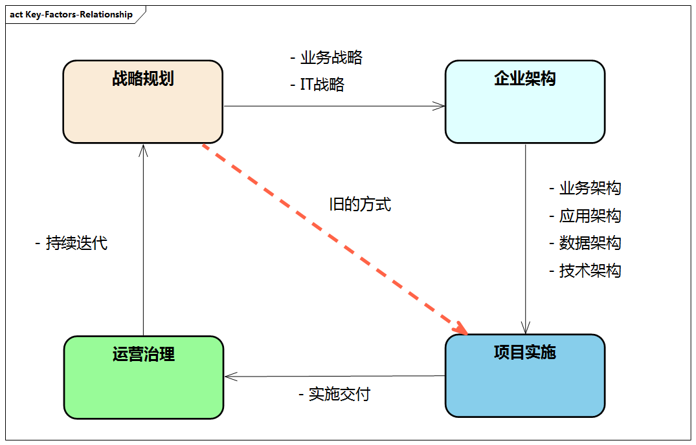

# 企业架构理论

本章首先讨论企业架构的基本概念；

然后介绍企业架构的发展；

接着重点对几个具有代表性的企业架构框架理论进行说明，包括

- [Zachman](ea-theory/zachman.md)
- [TOGAF](ea-theroy/togaf.md)
- [FEAF](ea-theroy/feaf.md)
- [DoDAF](ea-theroy/dodaf.md)
- [eTOM](ea-theory/etom.md)
- [ArchiMate](ea-theory/archimate.md)
- [Gartner](ea-theory/gartner.md)
- ......

最后进行企业架构框架理论综合分析，分析新时代对企业架构提出的新的挑战。

## 企业架构的基本概念

企业架构（Enterprise Architecture， EA）经过几十年的发展，有很多专家、组织、企业、研究机构都提出了企业架构的基本概念。总的来说，企业架构是一种描述企业的组织结构的技术，它是一种解决企业组织结构的方法。**通过架构的思考方式将一个企业、一个公司、一个系统复杂的内部关系进行结构化、体系化的抽象，并把相关的目标和当前现状通过不同视图进行直观展示，方便相关人员达成一致的认识，指导和驱动数字化项目落地实施**。

关于企业架构，我们来看看一些人员和组织给出的定义。

- **麻省理工学院**：企业架构是业务流程和IT基础设施的组织逻辑，反映企业运营模式的集成和标准化需求。
- **SearchCIO.com**：企业的概念蓝图，定义了一个组织的结构和运营，企业架构的意图是确定组织如何能够最有效地实现其当前和未来的目标。
- **John Zachman**：企业架构是构成企业的所有关键元素及其关系的综合描述，是企业的描述性表达，以及企业创建后进行改变的基线。
- **美国的Clinger-Cohen法案（1996）**：企业架构是一个集成的框架，用于演进或维护现存的信息技术和引入新的信息技术，来实现组织的战略目标和信息资源管理目标。
- **The Open Group**：企业架构主要定义所有构成企业的不同元素，以及这些元素怎样相互关联。
- **Gartner**：企业架构是通过创建、沟通和优化用以描述企业未来状态和发展的关键原则，以将业务愿景和战略转化为有效的企业变更的过程。
- **微软**：企业架构是一种概念性工具，可以帮助组织了解自身的结构和工作方式。它提供了企业地图，并将其用于业务和技术变更的路线规划。

从以上诸多定义可以看出，企业架构并没有统一的定义，不过我们可以发现在上述定义中的一些共性。

> 图例：企业架构与战略规划、项目实施、运营治理之间的关系

**在传统模式中，企业从战略规划到项目实施是脱节的，没有经过顶层思考和有效的架构规划**，而**企业架构作为战略和项目的桥梁**，从企业的整体战略规划出发，将业务战略和IT战略通过企业架构进行呈现，通过业务架构明确企业关键业务流程和逻辑，进一步明确与之匹配的IT架构，进而分解为应用架构、数据架构、技术架构，并通过数字化转型项目实施交付，进而进行运营治理，通过持续迭代反向推动战略规划，完成闭环。

企业架构可以帮助企业解决数字化转型中的许多问题，如业务创新、降本增效、风险控制、组织协同、技术升级等。

> 2017年，麦肯锡与亨利商学院开展了一项关于企业架构影响的调查，调查结果显示，使用企业架构的企业对比没有使用企业架构的企业
>
> - 数字化转型成功率高62%
> - IT复杂度降低67%
> - 成本节约47%
> - 产品推向市场快34%
> - 稳定性提高26%

企业可以基于企业架构的指导，优化业务运营模式，落实企业战略，改进业务流程，使企业运转更加高效。**企业架构可以使企业在同一语义、语境下协同开展跨领域合作**。

> **Tips:**
>
> 数字化转型的难点并不在于理论、方法、工具等，而在于整个企业结合相关方法，内部多方协同，进而通过项目落地，最终达到企业整体战略目标的过程。

## 企业架构的发展

企业架构的历史可以溯源到20世纪70年代，当时美国军方启动了[C4ISR计划](https://zh.wikipedia.org/wiki/C4ISR)，目的是建设一个大而全的系统来管理通信指挥作战的所有资源，将美国军事指挥重大战略决策及指挥员对下属部队实施指挥控制管理时所用的设备、器材、程序等资源都关联起来。

但那时候并未形成体系化的架构理论，经过多场战争的磨砺，这个系统逐步成熟，形成的理论在2003年发展成[DoDAF](dodaf.md)，即美国国防部体系架构框架。

1987年，当时在IBM工作的[John Zachman](https://en.wikipedia.org/wiki/John_Zachman)发表了著名的论文《信息系统架构框架》，首次提出了“信息系统架构框架”的概念。这篇论文中并没有明确提出企业架构这个概念，但其提出了一个企业信息系统的构成所需要的全部元素及它们之间的关系。这篇论文在业界被奉为企业架构框架理论的开山之作，John Zachman因此被称为“企业架构框架理论之父”。

企业架构的概念其实是美国政府机构提出来的。1996年，美国颁布的Clinger-Cohen法案要求美国政府用企业架构来改善各联邦政府获取和管理信息技术的方式。1999年9月，美国联邦政府CIO（首席信息官）委员会发布了联邦企业架构框架（FEAF），来指导联邦机构之间的公共业务流程、技术引入、信息流和系统投资。2002年2月，美国政府管理和预算办公室（OMB）基于FEAF开发了联邦企业架构（FEA），提出了五层参考模型，在联邦机构程序内和跨机构程序间，通过跨部门的分析找到重复的投资及相互的差距，助力联邦政府范围内的互操作、协同、交互。

随后，企业架构的理念很快得到了各个咨询公司和研究机构的认可。最早对企业架构进行研究的研究机构是Meta Group，它于2000年发表了《企业架构案头参考》，提供了一个经过验证的关于企业架构实施的方法论。微软、IBM、惠普等厂商也纷纷加入，希望应用企业架构来定位自身产品和服务。2005年，Gartner将Meta Group收购，进而提出了Gartner架构框架。

## 企业架构框架理论

## 企业架构框架理论综合分析

### 主流企业架构框架之对比

虽然企业架构框架理论所面对的问题都是同样的，但是由于他们出现的历史背景和研发团体都不相同，因而他们的适用范围和侧重角度都有较大的差异。本章将根据 [《Comparison of the Top Four Enterprise Architecture Methodologies》](https://www.bcs.org/articles-opinion-and-research/a-comparison-of-the-top-four-enterprise-architecture-frameworks/)所述对四种主流的企业架构框架理论（[Zachman](#1-zachman特点)，[FEA](#2-fea特点)，[Gartner](#4-gartner特点)，[TOGAF](#3-togaf特点)）进行比较。

#### 1. Zachman特点

在这四种框架之中，Zachman的历史算是最悠久的了，但是相对于后面的几种框架，该框架仅仅提供了关于企业架构内容的分类方法，而对于企业架构的创建过程却并没有相应的描述。但是作为第一个被广泛承认的企业架构框架理论，Zachman首先提出了一种根据不同的干系人的视角来对信息系统的各个方面进行描述的方法，从而使得站在不同角度的干系人可以针对信息系统的建设使用相同的描述方式进行沟通，而这也对其后的各种企业架构框架理论的发展指明了方向。在Zachman框架中，企业架构的内容被抽象成采用六种视角来观察的信息系统在六个方面的描述，并且Zachman认为当所有这些角度针对每个方面的描述都完备则一个企业架构的内容是完备的。

#### 2. FEA特点

作为最早的由政府部门提出的企业架构理论和进行的实践，FEA发展至今也具有了相当长的历史，虽然有文章称FEA还是处于婴儿期的阶段，但是它所提出的各种方法还是值得我们去研究的。与Zachman这种仅仅提供企业架构内容分类法的框架不同，FEA不仅在企业架构内容上由其自己的分类方式，而且关于架构过程也有着相当的描述。

严格的讲，FEA并不是一个严格意义上的企业架构框架，而是以美国联邦政府为客观对象的企业架构的具体实例，与之相比，在它之前诞生的FEAF（联邦企业架构框架）才算得上一个真正意义的企业架构框架理论，不过由于其在政府的企业架构方面的示范作用，FEA中所抽象出来的各种参考模型和治理方法倒比方法论级别的FEAF更加容易让人接受，所以在很多情况下，FEA也被看作是一种企业架构框架理论。正因为FEA不同于一个通用的企业架构框架理论，因而其具体内容相对明确，例如其对服务的分类就包括健康服务、教育服务、自然资源服务以及国土安全服务等有着明显政府性行为的服务，不过FEA所采用的架构内容分类方法的确是值得借鉴的，他首先采用服务的概念对企业部门的各种服务能力以业务线（Line-of-Business）为单位进行标识、组织和定义，并且将这些服务按照其使用的范围归纳为企业服务（Enterprise Service）和片段服务（Segment Service）两大类。通过这样的方式，联邦政府各部门的各条业务线得到了总结，而且原先功能上相互重复的服务也被识别了出来，从而有助于服务的重用。同时针对每条业务线或服务能力，FEA从业务、数据、应用和技术这几个方面进行详细的描述。所有这些层次的描述在FEA中通过五层参考模型的方式进行规范，从而为各个部门建立起一种统一的用于描述各自服务能力的方法。

除了针对内容的描述，FEA也针对企业架构的架构过程提出了指导。在FEA的观点中，各部门首先需要通过五层参考模型描述企业当前以及目标架构，根据差距分析找到现实和理想的差别，并且细化成各种实施项目。在为这些项目确立了投资和筹资战略后，对着这些项目进行实施和管理，从而促进企业的发展和企业架构的演进。

以上关于架构内容的定义和架构过程的描述是FEA的核心内容，除此之外联邦企业架构体系还包括了用以评估一个企业架构完整性、使用状况和使用效果的企业架构评估框架（EAAF），以及被OMB用来识别和管理各跨部门项目的联邦过渡框架（FTF）。

由此可见，相对于Zachman，FEA既含有针对架构内容的分类法，又具备架构过程描述，甚至还包括了用于评估架构水平的方法，所以FEA更加具备一个企业架构框架的特性。但是从抽象度和通用性的角度来看，Zachman框架无疑是一种通用的架构建设方法论，而FEA则更倾向于一种基于具体实例的最佳实践。

#### 3. TOGAF特点

与上面的框架都不同，由于TOGAF的目的是为企业架构的创建提供一套标准的方法，他既不同于Zachman那样仅仅介绍企业架构内容的分类法，也不同于FEA那样紧贴着美国联邦政府的组织架构和现实服务。与他们相比，TOGAF提出的是一套经过高度抽象的方法论，并且不依赖于任何一个具体的组织形式（例如，如果使用FEA来创建企业架构，和可能需要像美国政府那样建立OMB这样一个统一协调管理企业架构的组织，否则诸如FTF这样的框架将无从实施和管理），甚至他对自身提出的各个方法和内容分类法都没有硬性照搬的要求，也没有排斥其他任何架构框架理论，因而任何企业均可按照自身的情况对TOGAF进行裁剪或与其他框架进行混合，从而创建和维护符合自身情况的企业架构。

TOGAF的核心是架构开发方法（ADM：Architecture Development Method）。此套方法实际上是用来指导企业如何建立和维护其企业架构的一套流程化的架构开发步骤。首先ADM将架构过程看成一个循环迭代的过程，并且此迭代过程可以是分层级的，即企业可以使用一个小组负责整个企业架构的迭代开发，也可以由多个架构开发小组针对每一部份进行迭代开发，并最终归为一体。

在TOGAF中，ADM一共定义了十个步骤，除了“需求管理”这一步骤位于各个步骤中心作为其他各步骤的驱动和管理办法外，其余九个步骤还是有着先后关系的，即前面步骤的输出作为后面步骤的输入。与FEA过程的精神相类似，ADM也秉承如下思想来创建和管理企业架构：

- 识别和定义高层的策略、目标以及驱动力等。
- 创建针对架构的高层次的期望，亦即架构愿景。
- 细化架构愿景，在业务、数据、应用和技术这些层面进行详细描述，并针对采用相同方式描述的当前架构和目标架构进行差距分析。
- 将差距分析结果具体化为解决方案，进而形成一个个项目规划。
- 实施并管理这些架构项目。
- 在所有过程中监控内外部环境的变化，从而可以将变化快速反映到架构创建过程中。
  
由此可见，与FEA相比，前两步相当于FEA五层参考模型中PRM（Performace Reference Model）的目标，而第三步的细化又于FEA中后面的四层参考模型不谋而合（当然，FEA五层参考模型并不是一个架构过程的概念，但是ADM的使用过程并不排斥对他们的使用，况且其核心思想是一致的）。至于后面的差距分析直到项目的规划、实施以及管理又与FEA的架构过程在思想上是一致的。而且，通过上述步骤我们可以看出，ADM采用了自上而下的原则通过逐步细化的方式将企业高层的策略过渡到详细的技术实施，从而构建涵盖所有干系人角度的企业架构。需要注意的是，虽然ADM中的各大步骤在表面上有着先后依赖的关系，但是这种关系并不是硬性规定的，一个企业可以根据自己的需要调换这些步骤的顺序，甚至是跳过某些步骤，而这也是TOGAF所提倡的。此外，ADM除了定义这十大步骤，还详细定义了每大步骤所包含的各个小步骤、目标以及每大步骤的输入与输出。

在2009年，TOGAF推出了第9版。在此版本中，The Open Group为TOGAF加入了内容框架（CF，Content Framework），从此企业架构不单单是一份仅仅关于企业架构过程的框架理论了。在内容框架中，企业架构内容按照表现形式分为目录、矩阵和图形三种，并且根据ADM在各个阶段的目标定义了每个阶段需要完成的架构制品。除此之外，内容框架还对ADM中各个步骤的输入、输出与这些架构制品的关系进行了详细描述。

内容架构中关于架构制品的定义构成了TOGAF下的架构内容元模型，但是这一元模型也只是一种参考性材料，TOGAF并不建议将其强搬至各个企业或组织的架构实践当中。为了达到这种灵活度，内容框架采用插件方式对内容元模型进行组织，即把一些关键并常用的架构制品当作核心内容，并将其推荐到架构实践过程当中，而把剩下的架构制品分别归纳到治理扩展、服务扩展、流程建模扩展、数据扩展、基础设施整合扩展以及动机扩展这几个分组之中。需要注意的是，TOGAF只是对架构内容进行了建议，即便是核心分组中的架构制品在实践中的具体内容也应按照企业自身的需求而进行定制。

由此可见，TOGAF相对于其他框架理论，具有更加标准、更加通用的特点，而且自从在TOGAF 9种增加了内容框架之后，此企业架构框架理论的完整度也大幅提高，也正因为如此，TOGAF发展至今日已经得到了最广泛的应用，堪称业界最流行的企业架构框架理论。

#### 4. Gartner特点

与上述的企业架构框架不同，Gartner既不提供企业架构内容的分类法，也不提供企业架构的建设过程指南，因而从架构框架的定义来看，Gartner应该不能算是一个严格意义上的企业架构框架理论。Gartner并不提供通常意义上的方法论，而是以其在企业架构建设领域中积累的大量实践经验为基础，对外提供关于企业架构方面的各种最佳实践。因而，如果企业要借助Gartner的力量来建设企业架构，要么出资购买其资讯服务，要么就以Gartner公司提供的数个企业架构建设实例为参考来构建自身的企业架构。

虽然没有高度抽象且规范化的通用方法论来指导企业架构的建设，但Gartner关于企业架构的建设也有着自己的理念和实际案例。Gartner将企业架构看作为一个动态的过程，而不仅仅是一个静态的名词。在Gartner的观念中，企业架构建设的起点应该是对企业发展方向的明确，而不是仅仅对企业当前状态的描述，并且一个成功的企业架构应该能将业务拥有者、信息专家和技术实现者联系起来，并为他们提供一个统一的针对企业现状和发展方向的愿景。

#### 5. 四种框架的比较

上述四种企业架构框架各具特点，先将他们放在一起比较如下：

| |Zachman|ToGAF|FEA|Gartner|
|---|---|---|---|---|
|分类法完整度|4|3|2|1|
|过程完整度|1|4|2|3|
|参考模型指南|1|3|4|1|
|实践指南|1|2|2|4|
|成熟度模型|1|1|3|2|
|业务关注度|1|2|1|4|
|治理指南|1|2|3|3|
|企业划分指南|1|2|4|3|
|视角目录|1|2|4|2|
|厂商无关度|2|4|3|1|
|信息易获取性|2|4|2|1|
|价值获取效率|1|3|1|4|
|**总评分**|**17**|**32**|**31**|**29**|

在上面表格中评分量级从1至4，其意义分别定义如下：

1. 在当前评测方面无所表现。
2. 在当前评测方面有所表现，但是并不足够。
3. 在当前评测方面有着可以接受的表现。
4. 在当前评测方面有着很好的表现。

上述表格采用十二个方面对四个框架进行对比，其中每个评测方面的意义如下：

- **分类法完整度（Taxonomy completeness）**：用以表明当前框架理论对各种架构制品划分的优劣程度。
- **过程完整度（Process completeness）**：用以表明当前框架理论在指导人们创建企业架构方面是否采用了渐入式的方式，且表现如何。
- **参考模型指南（Reference model guidance）**：用以表明当前框架理论在帮助人们创建一系列相关的参考模型中的作用。
- **实践指南（Practice guidance）**：用以表明当前框架理论在帮助人们将企业架构的精神融入到组织中，并为其创建一个珍视并使用企业架构的企业文化时的帮助程度。
- **成熟度模型（Maturity model）**：用以表明当前框架理论在评估企业使用企业架构的有效性和成熟度方面的帮助程度。
- **业务关注度（Business focus）**：用以表明当前框架理论是否着眼于使用技术来驱动业务价值。其中，业务价值被定义为减少成本或增加收入。
- **治理指南（Governance guidance）**：用以表明当前框架理论在理解和创建有效的企业架构治理模型方面的帮助程度。
- **划分指南（Partitioning guidance）**：用以表明当前框架理论在帮助人们对企业进行有效的自治性分区划分方面的帮助程度。此种分区划分对于复杂性管理来说是一个重要的方法。
- **视角目录（Perspective catalog）**：用以表明当前框架理论在指导人们设置架构资产目录方面的帮助程度。这些架构资产会在未来的活动中被重用。
- **厂商无关度（Vendor neutrality）**：用以表明当前框架理论与某个特定咨询组织的锁定程度。此方面评分越高表示与特定厂商的锁定程度越低。
- **信息易获取性（Information availability）**：用以表明与当前框架理论相关的免费或廉价信息的数量和质量。
- **价值获取效率（Time to value）**：用以表明从开始使用当前框架理论到创建具有高度业务价值的解决方案这一过程的效率。

## 扩展阅读

- [C4ISR - 维基百科](https://zh.wikipedia.org/wiki/C4ISR)
- [美国防部军事信息系统体系架构框架(DODAF)概述和应用 - UML中国](http://www.uml.org.cn/qiyezjjs/202107162.asp)
- [美国国防部架构框架DoDAF2.0解读 - 知乎](https://zhuanlan.zhihu.com/p/466835525)
- [A comparison of the top four enterprise architecture frameworks](https://www.bcs.org/articles-opinion-and-research/a-comparison-of-the-top-four-enterprise-architecture-frameworks/)
- [John Zachman - 维基百科](https://en.wikipedia.org/wiki/John_Zachman)
- [Information systems architecture - 维基百科](https://en.wikipedia.org/wiki/Information_systems_architecture)
- [1987 IBM Systems Journal- A Framework for Information Systems Architecture PDF - zachman.com](https://www.zachman.com/images/ZI_PIcs/ibmsj2603e.pdf)
- [Gartner探讨最佳与最坏的EA和应用架构实践 - InfoQ](https://www.infoq.cn/article/2012/04/best-worst-ea-practices)